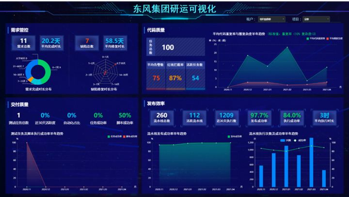

# 1、编写规范

- 按日期倒序编写产品发布日志
- 发布日志格式为表格格式，内容为功能列表；
- 核心信息项如下：
  - 发布版本
  - 发布日期
  - 发布范围
    - 新增
    - 优化
    - 缺陷修复

# 2、规划中（清单）

## 目标

- **发布V1.0.0版本，支持快速拉起DevOps能力（8月）**
- **代码质量检查标准制定（8月）**
  1. idea、gitlab、sonar统一规则库（p3c）
  2. gitlab commit支持异常阻断提交，阻止坏味道代码提交；
- **单元测试标准制定（8月）**
- **jira与gitlab issue的打通，方便问题的统一管理、快捷查看（8月）**
- **自动化测试用例开发标准制定（9月）**
- **DevOps可度量（衡量成功的原因、内容和方法）（9月）**
- **灰度发布规划（10月）--持续部署**
- **DevOps工具链（规划）**
- **效能度量平台（11月）**
  - 
- **全链路测试**

## 具化

## 具化

# 3、产品历程碑

## 2022年06月

### 发布版本（v1.1.0）

#### 发布日期：2022年06月30日

#### 发布范围

| 类别 | 功能                         | 功能描述 |
| ---- | ---------------------------- | -------- |
| 新增 | 单元测试报告上传gitlab pages |          |
|      |                              |          |
|      |                              |          |

#### 版本成效

- 真实发现了部分接口（数瞳）的稳定性问题，部分传参情况下存在bug；

### 发布版本（v1.0.0）

#### 发布日期：2022年06月24日

#### 发布范围

| 类别 | 功能            | 功能描述 | 相关文档        |
| :--- | :-------------- | :------- | :-------------- |
| 新增 | gitlab ci全流程 |          | xxx功能设计文档 |
|      |                 |          |                 |
|      |                 |          |                 |
|      |                 |          |                 |

#### commit清单

- 按功能拆分commit
- commit合并
- **commit名称   commit message**