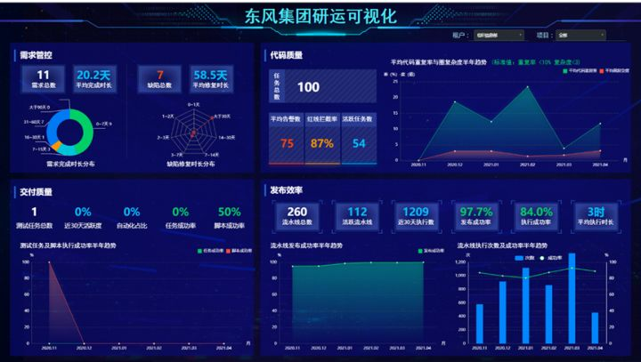

# 1 东风集团DevOps改革项目分享——嘉为蓝鲸

https://cloud.tencent.com/developer/article/2031558

## 可度量

**度量分析场景：**

通过一体化平台，实现研运全场景数据的统一收集和多维分析，基于度量工程能力建设起子公司级、项目级可视化大屏和各类度量模型，统筹分析数字研发项目研运近况，帮助IT管理层及时发现瓶颈，定制改进策略。

​																				图 ：研运可视化大屏