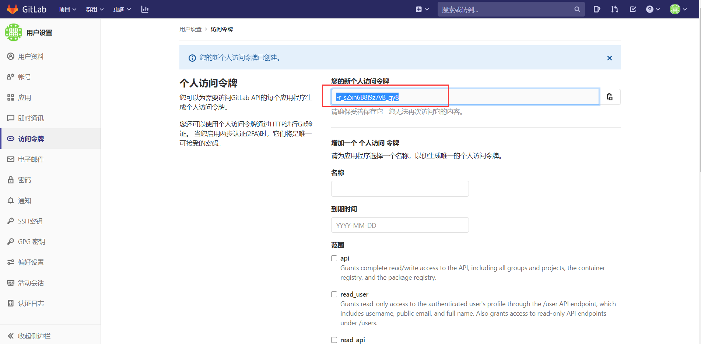

# 1、整体规划图


## **1.1 整体流程说明**

### **1.1.1 研发环节**

#### 1.1.1.1 研发工作流（人工）

​		研发工作流主要目的是规范研发日常研发工作，保障质量管理，经过功能设计、功能开发、单元测试用例开发、代码提交、代码合并请求、代码审查等阶段后进入持续集成阶段，开发完成后需要发起需求/补丁发布单：

- **功能设计**：收到OA、jira记录的需求或问题后，开始进行功能设计；
- **功能开发**：功能设计完成后，进入开发阶段，研发人员根据功能设计或故障描述完成功能开发；
- **单元测试用例开发**：新需求开发时，需要同步完成单元测试用例开发；
- **代码提交**：每一次代码提交会进行代码质量检查、
- **代码合并请求**：研发人员提交代码后，**需提交代码合并请求**（merge request），由代码管理人员进行审核；
- **代码审查**：代码管理人员收到合并请求后，完成代码合并，进入持续集成工作流；
- **确认代码变更范围**：开发完成后需要发起需求/补丁发布单，需要形成清晰的发布文档，确认代码变更范围，包含commit及jira issue范围；

#### 1.1.1.2 持续集成工作流（工具）

​		持续工作流主要目的是利用持续集成自动化工具实现产品的持续集成，更快、更好的完成版本发布；目前已经纳入流水线的环节为：代码质量检查、单元测试、集成测试、构建、部署；

- **代码质量检查**：把好发布包质量的第一关，优化当前反复发包的问题；
- **单元测试**（自动化）：接口质量控制的核心手段，最好要有；
- **集成测试**（自动化）：暂无方案；
- **构建**：完成代码编译、构建、推送；
- **部署**：完成发布包部署至**测试环境**。

### **1.1.2 测试环节**

#### 1.1.2.1 测试工作流（人工）

​		测试人员收到研发人员的发布需求后开启测试工作流，主要经过：代码比对、自动化测试脚本开发、集成测试（人工）等环节；

- **代码比对**：测试人员收到需求/补丁发布申请后，完成代码比对，确认变更范围是否有问题；
- **自动化测试脚本开发**：代码比对通过后，按需完成自动化测试脚本开发，开发完成后进入持续集成工作流阶段切出测试分支环节；
- **集成测试（人工）**：持续集成工作流阶段集成测试（自动化）环节通过后，测试人员开始集成测试（人工）环节，测试通过后开始正式发布；

#### 1.1.2.2 持续集成工作流（工具）

​		测试人员完成自动化测试脚本开发后提交，持续集成工作流启动，主要经过：代码比对、自动化测试脚本开发、集成测试（人工）后完成版本发布；

- **切出测试分支**：测试人员完成自动化测试脚本开发后，进入切出测试分支阶段；
- **构建**：切出测试分支后，开始完成应用包的构建；
- **部署**：构建完成后，部署至测试环境，进入集成测试（自动化）环节；
- **集成测试（自动化）**：完成自动化及承诺测试，自动发现问题，测试不通过则驳回待研发阶段，测试通过则继续往下，进入集成测试（人工阶段）；
- **切出发布分支**：完成集成测试（自动化）、集成测试（人工）环节后，切出发布分支，开始进行发布；
- **构建**：切出发布分支后，为保证包的可用性，再次进行构建环节；
- **部署**：切出发布分支后，为保证包的可用性，再次进行部署环节；
- **发布到制品库**：部署完成后，即可发布到制品库。

### **1.1.3 基础设施**

#### 1.1.3.1 环境

1. **开发环境（x86）**：作为开发迭代环境使用，允许持续升级，各产品组内部测试使用；

2. **测试环境（x86、arm）**（多版本：2.1.0, 3.0.0）：作为测试专用环境，不提供给开发人员使用；

3. **预发布环境（x86）**：作为开发使用的稳定环境，用于研发过程，跨组接口联调时使用；

   要求：研发环境与测试环境绝对隔离；

#### 1.1.3.2 工具

| 序号 | 用途                       | 工具名称                    | 工具版本           | 备注                                                         |
| :--: | -------------------------- | --------------------------- | ------------------ | ------------------------------------------------------------ |
|  1   | 代码 仓库                  | gitlab/gitlab-ce            | 14.10.1-ce.0       | 支持集成harbor、k8s等                                        |
|  2   | 持续集成任务执行器         | gitlab/gitlab-runner        | v14.10.1           |                                                              |
|  3   | 持续集成任务执行器辅助工具 | gitlab/gitlab-runner-helper | x86_64-f761588f    | 当使用docker、docker+machine或kubernetes执行器（excutor）之一时，GitLab Runner使用特定的容器来**处理Git、工件和缓存操作**。这个容器是由一个名为helper映像的特殊映像创建的。 |
|  4   | java应用构建环境           | maven                       |                    |                                                              |
|  5   | golang应用构建环境         | golang                      |                    | golang应用构建环境，默认安装make编译环境                     |
|  6   | docker 构建环境            | docker                      | latest             | docker in docker                                             |
|  7   | node js构建环境            | nodejs                      | 12.16.2-alpine3.11 |                                                              |
|  8   | k8s部署执行环境            | rancher/kubectl             | 1.16.6             | k8s部署执行环境                                              |
|  9   | sonarqube代码质量检查工具  | sonarqube                   |                    |                                                              |
|  10  | MeterSphere-自动化测试平台 | MeterSphere                 |                    |                                                              |

## **1.2自动化测试**


- 产品外部集成测试
- 冒烟测试
- 功能测试
- 性能测试
- 数据驱动
  - 【稳定数据】
  - 分租户维护测试组专用稳定数据，需要很大的存储空间？


- **集成测试：**
  - 测试人员：开发用例；
  - 研发人员：
- **范围：**
  - 单元测试
    - （junit + mock） 
    -   junit +springboot 内置容器
  - 集成测试
    - controller测试（接口）
    - service全流测试（**待研究**）
  - 
- **选型**
  - 接口测试：python + Selenium
  - 接口测试：jmeter
  - 性能测试：jmeter

**人工测试：**

- **双保险（研发+测试）**
  - 研发：未提供用例时，需要提供模块依赖关系，功能依赖关系；
  - 测试：根据提供的依赖关系完成关联测试；

**版本管理**

- **测试组管理版本：**
  - 大版本必须收编所有个性化分支；
  - **个性化分支必须减少，非必要不建议单开分支：研发环节输出规范流程文档，严格执行（各组长控制）**
  - 测试组可直接构建发布分支，完成测试、发布；
- **场景细化**
  - 短期迭代
  - 版本发布

**配置管理**

- 通用配置文件**（最小化）**（输出标准模板）
- 个性化配置文件；


## **1.3 研发环境与测试环境隔离**


### 1.3.1 开发环境

#### 1.3.1.1 知识工场

- 算子调试重度依赖服务工场算子服务、轻度依赖数据工场数据资源查询接口，目前开发环境不稳定，具体情况如下：
  - **服务工场算子服务**：开发环境算子服务基本处于不可用状态；
  - **数据工场数据资源查询接口**：已注册的数据资源经常会被删除重建，影响开发验证工作；

#### 1.3.1.2 数据工场

- 数据工场存在多版本开发测试的问题，开发环境无法满足要求，具体情况如下：
  - **V2.1.0版本**：需要依赖演示环境进行开发、测试；
  - **V3.0.0版本**：需要依赖开发环境进行开发、测试；

#### 1.3.1.3 服务工场

- 因为该环境提供给其他部门使用，部署服务较多，导致服务器CPU、内存资源较紧张，经常出现资源不够，服务无法启动的故障。

| 节点    | 资源 | Requests     | Limits |
| ------- | ---- | ------------ | ------ |
| host-60 | CPU  | 48core   90% |        |
|         | 内存 |              |        |
| host-61 |      |              |        |
|         |      |              |        |
| host-62 |      |              |        |
|         |      |              |        |


### 1.3.1 解决方案


### 1.3.1 测试环境

# 2 基础设施建设

## 2.0 基础工具集

| 序号 | 用途                       | 工具名称                    | 工具版本           | 备注                                                         |
| :--: | -------------------------- | --------------------------- | ------------------ | ------------------------------------------------------------ |
|  1   | 代码 仓库                  | gitlab/gitlab-ce            | 14.10.1-ce.0       | 支持集成harbor、k8s等                                        |
|  2   | 持续集成任务执行器         | gitlab/gitlab-runner        | v14.10.1           |                                                              |
|  3   | 持续集成任务执行器辅助工具 | gitlab/gitlab-runner-helper | x86_64-f761588f    | 当使用docker、docker+machine或kubernetes执行器（excutor）之一时，GitLab Runner使用特定的容器来**处理Git、工件和缓存操作**。这个容器是由一个名为helper映像的特殊映像创建的。 |
|  4   | java应用构建环境           | maven                       |                    |                                                              |
|  5   | golang应用构建环境         | golang                      | 1.10.3-stretch     | golang应用构建环境，默认安装make编译环境                     |
|  6   | docker 构建环境            | docker                      | latest             | docker in docker                                             |
|  7   | node js构建环境            | nodejs                      | 12.16.2-alpine3.11 |                                                              |
|  8   | k8s部署执行环境            | rancher/kubectl             | 1.16.6             | k8s部署执行环境                                              |

## 2.1 研发、测试协同平台

### 2.1.1 gitlab与jira双向集成

### 2.1.2 jira集成oa需求、bug

已提jiara api对接规范文档给OA组研发，对接中

## 2.2 代码质量检查

### 2.2.1 集成代码质量检查工具（Sonarqube）

#### 1、准备工作

##### 1.1、GitLab 用户令牌生成

具体步骤如下：

- 登录具有管理员权限的账号（一定要是管理员身份）访问地址 http://gitlab.example.com/profile/personal_access_tokens 进入令牌生成页面


- 输入令牌名称，勾选 api 、read_user、sudo 权限，点击【创建】按钮，即可生成用户令牌

##### 1.2、配置 GitLab 通用账户

这里为了方便统一管理，我们在 GitLab 上注册一个通用账号：sonarQube，作为对接 SonarQube 的统一账户，注册过程略，获取Token方式入下：
sonarQube 登录，点击 setting —> 访问令牌 ，获取的 User Token 为下边插件配置使用。同时还需要将 SonarQube 加到项目成员或项目所属项目组成员里面去，这样才能有权限 comment 和添加注释行。




##### 1.3、配置 sonar-gitlab-plugin 插件

​		admin 登录 SonarQube，点击 配置 —> 通用配置 —> GitLab —> Reporting —> 设置 GitLab User Token 以及 GitLab url。GitLab User Token 为 GitLab 上用户的 Token（这里使用上边统一账户 sonarQube Token），其他配置默认即可。


##### 1.4、SonarQube生成Token

在sonarqube中生成token供yml中使用


```shell
gitlab-ci使用（以java maven项目为例子）
1）配置pom.xml（以下为所需要加载的插件：spring-boot-maven-plugin、maven-compiler-plugin、sonar-maven-plugin、jacoco-maven-plugin）

<build>
　　<pluginManagement>
　　　　<plugins>
　　　　　　<plugin>
　　　　　　　　<groupId>org.springframework.boot</groupId>
　　　　　　　　<artifactId>spring-boot-maven-plugin</artifactId>
　　　　　　</plugin>

　　　　　　<plugin>
　　　　　　　　<groupId>org.apache.maven.plugins</groupId>
　　　　　　　　<artifactId>maven-compiler-plugin</artifactId>
　　　　　　</plugin>

　　　　　　<plugin>
　　　　　　　　<groupId>org.sonarsource.scanner.maven</groupId>
　　　　　　　　<artifactId>sonar-maven-plugin</artifactId>
　　　　　　　　　<version>3.6.1.1688</version>
　　　　　　</plugin>

　　　　　　<plugin>
　　　　　　　　　<groupId>org.jacoco</groupId>
　　　　　　　　　<artifactId>jacoco-maven-plugin</artifactId>
　　　　　　　　<version>0.8.5</version>
　　　　　　</plugin>

　　　　</plugins>
　　</pluginManagement>
</build>

2）gitlab-ci.yml

variables:
　　MAVEN_CLS_OPTS: "-s /usr/local/maven/conf/settings.xml --batch-mode"
　　MAVEN_OPTS: "-Daven.repo.local=/home/gitlab-runner/.m2/repository" 
　　SONAR_TOKEN: "24e536eec4084dc9859137c1734ebb6b1612de95"  　　# sonarqube生成的token
　　SONAR_HOST_URL: "http://192.168.6.16:9000/" 　　# sonarqube的地址
　　GIT_DEPTH: 1

stages:
　　- test

job1:
　　stage: test
　　script:
　　- cd $CI_PROJECT_DIR/demo
　　- mvn --batch-mode verify sonar:sonar -Dsonar.host.url=$SONAR_HOST_URL -Dsonar.login=$SONAR_TOKEN
```


#### 2、集成 GitLab-CI

然后，我们编写如下 `.gitlab-ci.yml` 文件：

```shell
image: maven:3.6.3-jdk-8

variables:
  SONAR_TOKEN: "${sonar_token}"
  SONAR_HOST_URL: "http://sonar.example.com:9000"
  GIT_DEPTH: 0

stages:
  - build_push
  - feedback_to_gitlab

#执行 SonarQube 分析，并将检测结果推送至 SonarQube
sonarqube_analysis:
  stage: build_push
  only:
    - merge_requests
    - master
  script:
    - mvn --batch-mode verify sonar:sonar -Dsonar.host.url=$SONAR_HOST_URL -Dsonar.login=$SONAR_TOKEN
  tags:
    - docker_runner

#执行 SonarQube 分析，并将检测结果反馈至 GitLab
sonarqube_gitlab_comment:
  stage: feedback_to_gitlab
  except:
    - master
  script:
    - mvn --batch-mode verify sonar:sonar -Dsonar.host.url=$SONAR_HOST_URL -Dsonar.login=$SONAR_TOKEN -Dsonar.analysis.mode=preview -Dsonar.gitlab.commit_sha=$CI_COMMIT_SHA -Dsonar.gitlab.ref_name=$CI_COMMIT_REF_NAME -Dsonar.gitlab.project_id=$CI_PROJECT_ID
  tags:
    - docker_runner
```

​		其中，参数 SONAR_TOKEN 为 SonarQube 的令牌，在 SonarQube 首次创建项目时即可创建。与 GitLab 的令牌一样，此 token 一旦创建，就需要马上保存，否则后续不再显示。

引入该 .gitlab-ci.yml 文件后，当我们提交代码时，上述 Runner 便会根据提交所来源的分支选择相应的执行脚本，具体描述如下：

- 若提交为主分支提交（或合并至主分支），则执行器 docker_runner 会执行 SonarQube 的分析指令，并将分析结果报送至 SonarQube 平台

- 若提交为非主分支提交，则执行器 docker_runner 会执行 SonarQube 的分析指令，并将分析结果反馈至 GitLab 中对应的分支下

#### 3、提交验证

现在，我们分别在其他分支和主分支提交代码，查看提交结果。

在提交其他分支代码时，由于我们的代码中有严重 BUG，SonarQube 会在此分支下标记出 BUG 的具体信息，并标记该流水线的状态为失败。


## 2.2 单元测试

**输出单元测试模板文档**

## 2.3 集成测试（测试组沟通-是否有建设自动化测试平台的规划）

## 2.4 持续

## 2.4 项目结构规划

- devops
  - manifests
    - 模块名
      - deployment.yaml
      - configmap.yaml
  - release
    - 产品发布日志.md
    - 功能设计文档？
  - ops
    - 产品开发运维文档.md


# 3 研发环节

## 3.1 需求/bug（自动化）

### 

## 3.2 功能设计（人工）


## 3.3 功能开发（人工）

### 3.3.1 分支管理规范

**3类分支（main、特性分支-feature-xxx、测试分支-test-xxx、发布分支-release-xxx），1个主分支（main）、1个tag**

**1）规则一，开始工作前，从master创建feature分支。**
从代表最新已发布版本的master分支上创建一个通常以feature/前缀命名的特性分支，然后在这个分支上提交代码修改。也就是说，每个工作项（可以是一个人完成，或是多个人协作完成）对应一个特性分支，所有的修改都不允许直接提交到master分支。


**2）规则二，通过合并feature分支，形成release分支。**
从master分支上拉出一条新分支，将所有本次要集成或发布的feature分支依次合并过去，从而得到release分支。release分支通常以release/前缀命名。


**3）规则三，发布到线上正式环境后，合并相应的release分支到main分支，在main分支上添加tag，同时删除该release分支关联的feature分支。**
为了避免在代码仓库里堆积大量历史上的feature分支，还应该清理掉已经上线部分feature分支。**如果要回溯历史版本，只需在main分支上找到相应的版本的tag即可。**


#### 问题清单

- 历史版本开发需求，并在历史版本发布：
  - 历史版本与主干最新版本逻辑差异较大：需要在历史版本及主干完成2次开发，并且分别提测；

#### [#](https://woai3c.github.io/introduction-to-front-end-engineering/02.html#开发新功能)开发新功能

当团队成员开发新功能时，需要从 dev 上拉一个 `feature-功能名称-开发姓名` 分支进行开发，例如：`feature-login-tgz`。开发完成后需要合并回 dev 分支。

#### [#](https://woai3c.github.io/introduction-to-front-end-engineering/02.html#修改-bug)修改 bug

当团队成员修改 bug 时，需要从有 bug 的分支（环境）上拉一个 `bug-功能名称-开发姓名` 分支进行修复，例如：`bug-login-tgz`。修复完成后需要合并回原来出现 bug 的分支。

以 `feature` 或 `bug` 开始的分支都属于临时分支，在通过测试并上线后需要将临时分支进行删除。避免 git 上出现太多无用的分支。

#### [#](https://woai3c.github.io/introduction-to-front-end-engineering/02.html#合并分支)合并分支

在将一个分支合并到另一个分支时（例如将 `feature-*` 合并到 dev），需要查看自己的新分支中有没有多个重复提交或意义不明的 commit。如果有，则需要对它们进行合并（git rebase）。示例：

```bash
# 这两个 commit 可以合并成一个
chore: 修改按钮文字
chore: 修改按钮样式

# 合并后
chore: 修改按钮样式及文字
```

**注意**：在将 `feature-*` 合并到 dev 时，需要先将 dev 分支合并到 `feature-*` 分支，然后再将 `feature-*` 合并到 dev 分支，避免出现代码冲突的情况。同理，合并 `bug-*` 分支也一样。

#### [#](https://woai3c.github.io/introduction-to-front-end-engineering/02.html#部署)部署

当 dev 分支通过测试后，就可以合并到 master 进行发布了。

#### [#](https://woai3c.github.io/introduction-to-front-end-engineering/02.html#发布时可能出现的意外情况)发布时可能出现的意外情况

举个例子，假设程序要新增 a、b 两个功能，我们的操作流程是这样的：

1. 从 dev 分支拉两个新分支 `feature-a-tgz`、`feature-b-tgz`。
2. 开发完成合并回 dev。
3. dev 测试完毕后，合并到 master 进行发布。

如果这时突然被告知 b 功能不上，只上 a 功能。我们可以将 `feature-a-tgz` 分支重新部署到测试环境，这样就不用做任何的代码回滚。只要 `feature-a-tgz` 分支测试通过就可以直接合到 master 进行线上发布。

### 3.3.2 git commit 规范

git 在每次提交时，都需要填写 commit message。

```bash
git commit -m 'this is a test'
```

commit message 就是对你这次的代码提交进行一个简单的说明，好的提交说明可以让人一眼就明白这次代码提交做了什么。


既然明白了 commit message 的重要性，那我们就更要好好的学习一下 commit message 规范。下面让我们看一下 commit message 的格式：

```md
<type>(<scope>): <subject>
<BLANK LINE>
<body>
<BLANK LINE>
<footer>
```

我们可以发现，commit message 分为三个部分(使用空行分割):

1. 标题行（subject）: 必填, 描述主要修改类型和内容。
2. 主题内容（body）: 描述为什么修改, 做了什么样的修改, 以及开发的思路等等。
3. 页脚注释（footer）: 可以写注释，放 BUG 号的链接。

#### type（提交类型）

**commit 的类型：**

- **feat:** 新功能、新特性
- **fix:** 修改 bug
- **perf:** 更改代码，以提高性能（在不影响代码内部行为的前提下，对程序性能进行优化）
- **refactor:** 代码重构（重构，在不影响代码内部行为、功能下的代码修改）
- **docs:** 文档修改
- **style:** 代码格式修改, 注意不是 css 修改（例如分号修改）
- **test:** 测试用例新增、修改
- **build:** 影响项目构建或依赖项修改
- **revert:** 恢复上一次提交
- **ci:** 持续集成相关文件修改
- **chore:** 其他修改（不在上述类型中的修改）
- **release:** 发布新版本

#### scope（影响范围）

commit message 影响的功能或文件范围, 比如: route, component, utils, build...

#### subject（提交概述）

commit message 的概述

#### body（提交内容）

具体修改内容, 可以分为多行.

#### footer（补充信息）

一些备注, 通常是 BREAKING CHANGE 或修复的 bug 的链接.

#### 约定式提交规范

- 每个提交都必须使用类型字段前缀，它由一个名词组成，诸如 `feat` 或 `fix` ，其后接一个可选的作用域字段，以及一个必要的冒号（英文半角）和空格。
- 当一个提交为应用或类库实现了新特性时，必须使用 `feat` 类型。
- 当一个提交为应用修复了 `bug` 时，必须使用 `fix` 类型。
- 作用域字段可以跟随在类型字段后面。作用域必须是一个描述某部分代码的名词，并用圆括号包围，例如： `fix(parser):`
- 描述字段必须紧接在类型/作用域前缀的空格之后。描述指的是对代码变更的简短总结，例如： `fix: array parsing issue when multiple spaces were contained in string.`
- 在简短描述之后，可以编写更长的提交正文，为代码变更提供额外的上下文信息。正文必须起始于描述字段结束的一个空行后。
- 在正文结束的一个空行之后，可以编写一行或多行脚注。脚注必须包含关于提交的元信息，例如：关联的合并请求、Reviewer、破坏性变更，每条元信息一行。
- 破坏性变更必须标示在正文区域最开始处，或脚注区域中某一行的开始。一个破坏性变更必须包含大写的文本 `BREAKING CHANGE`，后面紧跟冒号和空格。
- 在 `BREAKING CHANGE:` 之后必须提供描述，以描述对 API 的变更。例如： `BREAKING CHANGE: environment variables now take precedence over config files.`
- 在提交说明中，可以使用 `feat` 和 `fix` 之外的类型。
- 工具的实现必须不区分大小写地解析构成约定式提交的信息单元，只有 `BREAKING CHANGE` 必须是大写的。
- 可以在类型/作用域前缀之后，: 之前，附加 `!` 字符，以进一步提醒注意破坏性变更。当有 `!` 前缀时，正文或脚注内必须包含 `BREAKING CHANGE: description`

#### 示例

##### fix（修复BUG）

每次 git commit 最好加上范围描述。

例如这次 BUG 修复影响到全局，可以加个 global。如果影响的是某个目录或某个功能，可以加上该目录的路径，或者对应的功能名称。

```js
// 示例1
fix(global):修复checkbox不能复选的问题
// 示例2 下面圆括号里的 common 为通用管理的名称
fix(common): 修复字体过小的BUG，将通用管理下所有页面的默认字体大小修改为 14px
// 示例3
fix(test): value.length -> values.length
```

##### feat（添加新功能或新页面）

```js
feat: 添加网站主页静态页面

这是一个示例，假设对任务静态页面进行了一些描述。
 
这里是备注，可以是放 BUG 链接（gitlab issue或jira issue）或者一些重要性的东西。
```

##### chore（其他修改）

chore 的中文翻译为日常事务、例行工作。顾名思义，即不在其他 commit 类型中的修改，都可以用 chore 表示。

```js
chore: 将表格中的查看详情改为详情
```

其他类型的 commit 和上面三个示例差不多，在此不再赘述。

#### commit合并

### 3.3.3 功能开发规范

#### 3.3.3.1 需求开发


#### 3.3.3.2 bug修复

## 3.4 单元测试用例开发（人工）

## 3.5 代码提交（人工）

## 3.6 代码合并请求（人工）


## 3.7 代码审查（人工）

审查规范

## 3.8 代码质量检查（自动化）

## 3.8 单元测试（自动化）

## 3.9 集成测试（自动化）

## 3.10 构建（自动化）

## 3.11 部署（自动化）

## 3.12 发布到制品库（自动化）

## 3.13 确认变更范围（人工）


# 3 测试环节

## 3.1 需求/bug补丁包发布（人工）

## 3.2 代码比对（人工）

## 3.3 自动化测试脚本开发（人工）

## 3.4 切出测试分支（人工）

## 3.5 构建（自动化）

## 3.6 部署（自动化）

## 3.7 集成测试（自动化）

## 3.8 集成测试（人工）

## 3.9 切出发布分支

## 3.10 发布到制品库

# 4 关于流程优化的一点思考

## 4.1 优化

 遗留问题（待优化项）：

2. 每个project需要独立定义一个.gitlab-ci.yml文件，无法复用；（https://wi1dcard.dev/posts/reuse-gitlab-ci-configs-across-projects/）（可以通过include关键字优化）
2. **优化发布环节：改为release-job模式，直接生成assets（参考github模式）；**
   1. https://docs.gitlab.cn/jh/user/project/releases/
3. pipeline引入代码质量管理工具；**（已完成）**
4. 开发阶段场景梳理（commit + merge request策略如何配置？）
5. 如何做版本迭代：补丁包、版本包（全部以tag的方式？？）

