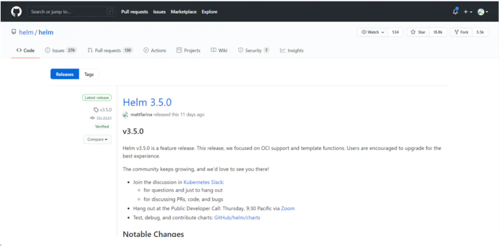
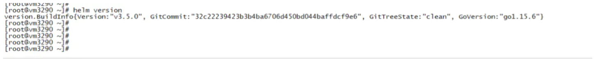
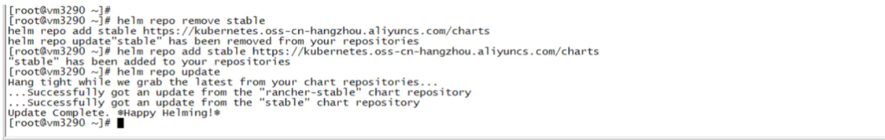
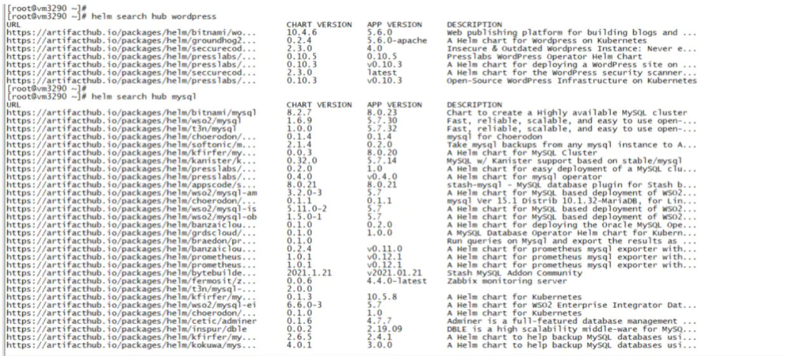
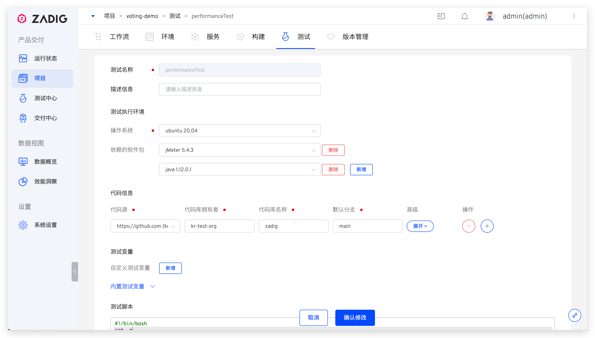
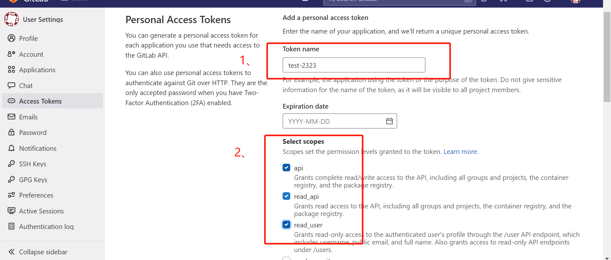
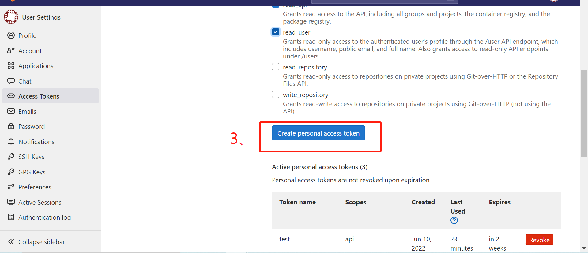
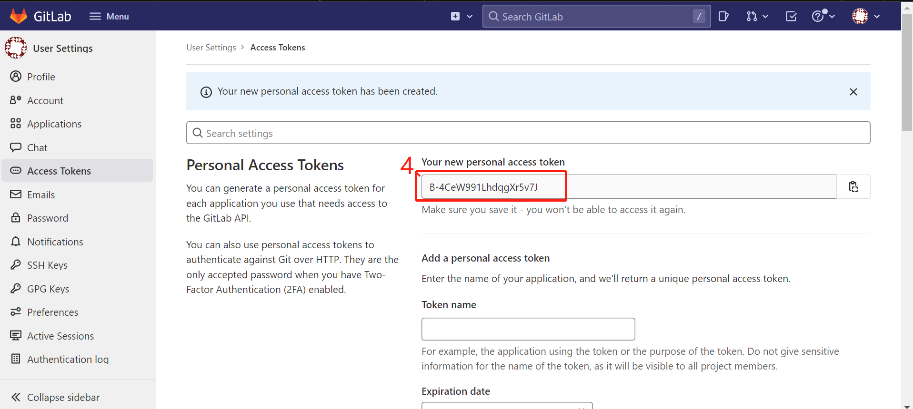

1 安装k3s

## Prepare the Images Directory and K3s Binary

Obtain the images tar file for your architecture from the [releases](https://github.com/rancher/k3s/releases) page for the version of K3s you will be running.

Place the tar file in the `images` directory, for example:

```sh
sudo mkdir -p /var/lib/rancher/k3s/agent/images/
sudo cp ./k3s-airgap-images-$ARCH.tar /var/lib/rancher/k3s/agent/images/
```

Place the k3s binary at `/usr/local/bin/k3s` and ensure it is executable.

Follow the steps in the next section to install K3s.

## Install K3s

### Prerequisites

- Before installing K3s, complete the the [Private Registry Method](https://rancher.com/docs/k3s/latest/en/installation/airgap/#private-registry-method) or the [Manually Deploy Images Method](https://rancher.com/docs/k3s/latest/en/installation/airgap/#manually-deploy-images-method) above to prepopulate the images that K3s needs to install.
- Download the K3s binary from the [releases](https://github.com/rancher/k3s/releases) page, matching the same version used to get the airgap images. Place the binary in `/usr/local/bin` on each air-gapped node and ensure it is executable.
- Download the K3s install script at [https://get.k3s.io](https://get.k3s.io/). Place the install script anywhere on each air-gapped node, and name it `install.sh`.

When running the K3s script with the `INSTALL_K3S_SKIP_DOWNLOAD` environment variable, K3s will use the local version of the script and binary.

### Installing K3s in an Air-Gapped Environment

You can install K3s on one or more servers as described below.

- [SINGLE SERVER CONFIGURATION](https://rancher.com/docs/k3s/latest/en/installation/airgap/#)
- [HIGH AVAILABILITY CONFIGURATION](https://rancher.com/docs/k3s/latest/en/installation/airgap/#)

To install K3s on a single server, simply do the following on the server node:

```
INSTALL_K3S_SKIP_DOWNLOAD=true ./install.sh
```

Then, to optionally add additional agents do the following on each agent node. Take care to ensure you replace `myserver` with the IP or valid DNS of the server and replace `mynodetoken` with the node token from the server typically at `/var/lib/rancher/k3s/server/node-token`

```
INSTALL_K3S_SKIP_DOWNLOAD=true K3S_URL=https://myserver:6443 K3S_TOKEN=mynodetoken ./install.sh
```

> **NOTE:**K3s additionally provides a `--resolv-conf` flag for kubelets, which may help with configuring DNS in air-gap networks.

### 安装k3s镜像仓库（私服）

https://zhuanlan.zhihu.com/p/457423718

k3s有自己的简易`containerd`第三方镜像仓库配置，位于`/etc/rancher/k3s/registries.yaml`，它会将内容转换为`containerd`的配置，生成后的`containerd`配置文件位于`/var/lib/rancher/k3s/agent/etc/containerd/config.toml`下。

配置文件分为两部分，`mirrors`和`configs`，`mirrors`对应镜像仓库名称及地址，`configs`对应每个`mirror`的证书及用户配置。一个常规的配置示例如下：

```yaml
mirrors:
  "nexus.mycompany.com:8083":
    endpoint:
      - "http://nexus.mycompany.com:8083"
  "registry.cloudprovider.com":
    endpoint:
      - "https://registry.cloudprovider.com"
configs:
  "nexus.mycompany.com:8083":
    auth:
      username: dev # this is the registry username
      password: dev@123 # this is the registry password
  "xxx.xxx.xxx":
    auth:
      username: jackson # this is the registry username
      password: 5W}(5ppT2bMJ # this is the registry password
```

这时通过`systemctl restart k3s`或`systemctl restart k3s-agent`，再查看`/var/lib/rancher/k3s/agent/etc/containerd/config.toml` 可发现配置中增加的以下项：

```yaml
[plugins.cri.registry.mirrors]

[plugins.cri.registry.mirrors."registry.cloudprovider.com"]
  endpoint = ["https://registry.cloudprovider.com"]

[plugins.cri.registry.mirrors."nexus.mycompany.com:8083"]
  endpoint = ["http://nexus.mycompany.com:8083"]

[plugins.cri.registry.configs."registry.cloudprovider.com".auth]
  username = "jackson"
  password = "5W}(5ppT2bMJ"

[plugins.cri.registry.configs."nexus.mycompany.com:8083".auth]
  username = "dev"
  password = "dev@123"
```

最后可尝试通过`k3s crictl pull nexus.mycompany.com:8083/mygroup/test:0.0.1`或`k3s crictl pull registry.cloudprovider.com/mygroup/test:0.0.1`来测试私有镜像仓库的拉取是否能够成功。

如果`k3s`搭建在多台机器上，则需要每一台都进行配置才能正常在 集群中接取私有镜像。


## 管理 K3s

k3s默认使用container

两者命令对比表：

| id   | containerd 命令                       | docker 命令                           | 备注                      |
| ---- | ------------------------------------- | ------------------------------------- | ------------------------- |
| 1    | ctr image ls                          | docker images                         | 获取image信息             |
| 2    | ctr image pull nginx                  | docker pull nginx                     | pull 一个nginx的image     |
| 3    | ctr image tag nginx nginx-test        | docker tag nginx nginx-test           | tag 一个nginx的image      |
| 4    | ctr image push nginx-test             | docker push nginx-test                | push nginx-test的image    |
| 5    | ctr image pull nginx                  | docker pull nginx                     | pull 一个nginx的image     |
| 6    | ctr image import nginx.tar            | docker load<nginx.tar.gz              | 导入本地镜像ctr不支持压缩 |
| 7    | ctr run -d --env 111 nginx-test nginx | docker run -d --name=nginx nginx-test | 运行的一个容器            |
| 8    | ctr task ls                           | docker ps                             | 查看运行的容器            |

# 2 安装helm3

- ## 2.1 获取helm

   [helm客户端地址](https://links.jianshu.com/go?to=https%3A%2F%2Fgithub.com%2Fhelm%2Fhelm%2Freleases%2Ftag%2Fv3.5.0)

  

  

- ## 3.2 安装helm3

```shell
wget https://get.helm.sh/helm-v3.5.0-linux-amd64.tar.gz
tar -zxvf helm-v3.5.0-linux-amd64.tar.gz
chmod 755 linux-amd64/helm
cp linux-amd64/helm /usr/bin/
cp linux-amd64/helm /usr/local/bin/
```

## 3.3 配置参数

```shell
export KUBECONFIG=/etc/rancher/k3s/k3s.yaml
```

**把上面的命令加入到~/.bashrc里，然后再执行命令source ~/.bashrc**

## 3.4 安装验证

```shell
helm version
```



## 3.5 更新安装源

```shell
导入国外源
helm repo add stable https://charts.helm.sh/stable
helm repo update

导入阿里源
helm repo remove stable
helm repo add stable https://kubernetes.oss-cn-hangzhou.aliyuncs.com/charts
helm repo update
helm list
```




## 3.6 命令测试

```shell
helm search hub wordpress
helm search hub mysql
helm install happy-panda stable/mariadb
helm status happy-panda
helm show values stable/mariadb
```




# 3 安装helm3

每个Helm [版本](https://github.com/helm/helm/releases)都提供了各种操作系统的二进制版本，这些版本可以手动下载和安装。

1. 下载 [需要的版本](https://github.com/helm/helm/releases)
2. 解压(`tar -zxvf helm-v3.0.0-linux-amd64.tar.gz`)
3. 在解压目中找到`helm`程序，移动到需要的目录中(`mv linux-amd64/helm /usr/local/bin/helm`)
4. 修改环境变量`export KUBECONFIG=/etc/rancher/k3s/k3s.yaml`

# 4 安装zadig

> IP 为 Kubernetes 任一节点的外网可访问 IP。

```bash
export NAMESPACE=<Zadig 安装的 NAMESPACE>
export IP=<IP>
export PORT=<PORT>

helm upgrade --install zadig koderover-chart/zadig --namespace ${NAMESPACE} --version=1.10.0 --set endpoint.type=IP \
    --set endpoint.IP=${IP} \
    --set gloo.gatewayProxies.gatewayProxy.service.httpNodePort=${PORT} \
    --set global.extensions.extAuth.extauthzServerRef.namespace=${NAMESPACE} \
    --set gloo.gatewayProxies.gatewayProxy.service.type=NodePort \
    --set "dex.config.staticClients[0].redirectURIs[0]=http://${IP}:${PORT}/api/v1/callback,dex.config.staticClients[0].id=zadig,dex.config.staticClients[0].name=zadig,dex.config.staticClients[0].secret=ZXhhbXBsZS1hcHAtc2VjcmV0"
```

## 4.1 实践案例

### 4.1.1 测试实践

下面介绍主流的测试框架/工具在 Zadig 中的使用实践，如何利用测试能力最大程度的为软件交付保驾护航，以供参考。

#### [#](https://docs.koderover.com/zadig/v1.11.0/test/practice/#测试框架-工具)测试框架/工具

##### [#](https://docs.koderover.com/zadig/v1.11.0/test/practice/#jmeter)JMeter

> 关于 JMeter 的更多信息可点击[链接 (opens new window)](https://github.com/apache/jmeter)查看。

##### [#](https://docs.koderover.com/zadig/v1.11.0/test/practice/#组织自动化测试代码)组织自动化测试代码

根据实际测试业务和功能，编写自动化测试代码并组织在代码仓库中。本实践中将使用 JMeter 对 KodeRover 官网进行一个简单的压测，自动化测试源码可点击[链接 (opens new window)](https://github.com/koderover/zadig/tree/main/examples/jMeter-demo)查看。

##### [#](https://docs.koderover.com/zadig/v1.11.0/test/practice/#配置自动化测试)配置自动化测试



 

进入 Zadig 的具体项目，完成自动化测试的配置，说明如下：

- 配置测试执行环境：选择执行自动化测试时所必须的软件包，本例中依赖的软件包分别为 `jMeter 5.4.3` 和 `java 1.12.0.1`。如果系统内置的软件包种类或版本无法满足测试需求，也可以参考[软件包配置](https://docs.koderover.com/zadig/v1.11.0/settings/app/)新增软件包
- 配置代码信息：配置执行自动化测试所必须的相关代码库，包括但不限于：
  - 自动化测试用例源码所在的代码仓库
  - 执行自动化测试依赖的相关基础组件库
- 配置测试脚本：配置运行自动化测试的脚本，本例中测试脚本如下：

```bash
#!/bin/bash
set -ex
cd zadig/examples/jMeter-demo/
jmeter -n -t demo.jmx -l demo.jtl # run test
if [ -e reports ]; then
    rm -rf reports
fi
jmeter -g demo.jtl -o reports # generate reports
```

1
2
3
4
5
6
7
8

- 高级配置：配置测试结果导出以便在测试执行完毕后下载测试报告进行分析。填写测试报告目录，本例中为 `$WORKSPACE/zadig/examples/jMeter-demo/reports`

##### [#](https://docs.koderover.com/zadig/v1.11.0/test/practice/#执行自动化测试)执行自动化测试

配置完毕后，执行自动化测试。


##### [#](https://docs.koderover.com/zadig/v1.11.0/test/practice/#分析测试报告)分析测试报告

暂不支持在平台直接浏览测试报告，待自动化测试运行完毕后，点击`下载`将测试报告下载到本地。


解读下载的测试报告，查看本次压力测试的结果，分析性能瓶颈。

 

#### [#](https://docs.koderover.com/zadig/v1.11.0/test/practice/#ginkgo)Ginkgo

> 关于 Ginkgo 的更多信息可点击[链接 (opens new window)](https://github.com/onsi/ginkgo)查看。

##### [#](https://docs.koderover.com/zadig/v1.11.0/test/practice/#组织自动化测试代码-2)组织自动化测试代码

根据实际测试业务和功能，编写自动化测试代码并组织在代码仓库中。本实践中将对 KodeRover 官网及文档站的可用性进行自动化检测，自动化测试源码可点击[链接 (opens new window)](https://github.com/koderover/zadig/tree/main/examples/test-demo/test)查看。

##### [#](https://docs.koderover.com/zadig/v1.11.0/test/practice/#配置自动化测试-2)配置自动化测试

 

进入 Zadig 的具体项目，完成自动化测试的配置，说明如下：

- 配置测试执行环境：选择执行自动化测试时所必须的软件包，本例中对 Golang 的版本有要求，可配置 `go 1.16.13`，软件包管理可参考：[软件包配置](https://docs.koderover.com/zadig/v1.11.0/settings/app/)
- 配置代码信息：配置执行自动化测试所必须的相关代码库，包括但不限于：
  - 自动化测试用例源码所在的代码仓库
  - 执行自动化测试依赖的相关基础组件库
- 配置测试脚本：配置运行自动化测试的脚本，本例中测试脚本如下：

```bash
#!/bin/bash
set -ex
export GOPROXY=https://goproxy.cn,direct
go get github.com/onsi/ginkgo/v2/ginkgo
go get github.com/onsi/gomega/...
cd zadig/examples/test-demo/test
ginkgo -v --junit-report=out.xml # 运行测试用例并产出 Junit XML 格式的测试报告
```

1
2
3
4
5
6
7

- 测试报告配置：配置 Junit XML 格式的测试报告目录，本例中为 `$WORKSPACE/zadig/examples/test-demo/test`

##### [#](https://docs.koderover.com/zadig/v1.11.0/test/practice/#执行自动化测试-2)执行自动化测试

配置完毕后，执行自动化测试。


##### [#](https://docs.koderover.com/zadig/v1.11.0/test/practice/#分析测试报告-2)分析测试报告

待自动化测试运行完毕后点击查看测试报告，可查看每一条用例的执行详情，快速过滤失败的用例重点分析。

 

#### [#](https://docs.koderover.com/zadig/v1.11.0/test/practice/#pytest)Pytest

> 关于 Pytest 的更多信息可点击[链接 (opens new window)](https://github.com/pytest-dev/pytest)查看。

##### [#](https://docs.koderover.com/zadig/v1.11.0/test/practice/#组织自动化测试代码-3)组织自动化测试代码

根据实际测试业务和功能，编写自动化测试代码并组织在代码仓库中。本实践中将使用 Pytest 进行数学运算测试，自动化测试源码可点击[链接 (opens new window)](https://github.com/koderover/zadig/tree/main/examples/pytest-demo/)查看。

##### [#](https://docs.koderover.com/zadig/v1.11.0/test/practice/#配置自动化测试-3)配置自动化测试

 

进入 Zadig 的具体项目，完成自动化测试的配置，说明如下：

- 配置测试执行环境：选择执行自动化测试时所必须的软件包，本例中对 Python 的版本有要求，可配置 `Python 3.7.0`，软件包管理可参考：[软件包配置](https://docs.koderover.com/zadig/v1.11.0/settings/app/)
- 配置代码信息：配置执行自动化测试所必须的相关代码库，包括但不限于：
  - 自动化测试用例源码所在的代码仓库
  - 执行自动化测试依赖的相关基础组件库
- 配置测试脚本：配置运行自动化测试的脚本，本例中测试脚本如下：

```bash
#!/bin/bash
set -ex
pip3 install pytest-html
pip3 install pytest
cd $WORKSPACE/zadig/examples/pytest-demo
pytest --junitxml=./junit.xml --html=./report.html # 执行测试并生成 JUnit xml 测试报告和 Html 测试报告
```

1
2
3
4
5
6

- 测试报告配置：按需配置 JUnit xml 格式和 Html 格式的测试报告。
  - Junit 报告：本例中为 `$WORKSPACE/zadig/examples/pytest-demo`
  - Html 报告：本例中为 `$WORKSPACE/zadig/examples/pytest-demo/*.html`

##### [#](https://docs.koderover.com/zadig/v1.11.0/test/practice/#执行自动化测试-3)执行自动化测试

配置完毕后，执行自动化测试。


##### [#](https://docs.koderover.com/zadig/v1.11.0/test/practice/#分析测试报告-3)分析测试报告

待自动化测试运行完毕后点击查看测试报告，可查看每一条用例的执行详情，快速过滤失败的用例重点分析。

 

### [#](https://docs.koderover.com/zadig/v1.11.0/test/practice/#进阶使用)进阶使用

有了自动化测试后，在 Zadig 上如何使用才能最大程度的发挥其价值，切切实实地为日常业务迭代中提供质量保障，下面我们展开介绍。

#### [#](https://docs.koderover.com/zadig/v1.11.0/test/practice/#和环境联动)和环境联动

​	将自动化测试和工作流关联起来，当日常运行工作流更新环境后，会自动执行自动化测试。可以实现只要环境有变更，就第一时间对其做自动化测试。

 


# 5 安装gitlab runner工具

## 5.1 docker

```shell
docker run -d --name gitlab-runner --restart always \
  -v /var/run/docker.sock:/var/run/docker.sock \
  -v /srv/gitlab-runner/config:/etc/gitlab-runner \
  gitlab/gitlab-runner:latest
```

## 5.2 k8s（helm）

```shell
helm install --namespace <NAMESPACE> --name gitlab-runner -f <CONFIG_VALUES_FILE> gitlab/gitlab-runner
```

## 5.3 实践案例

https://blog.csdn.net/boling_cavalry/article/details/106991691

https://xinchen.blog.csdn.net/article/details/106991576

https://github.com/zq2599/blog_demos

### 5.3.1 配置gitlab runner

**本次实战内容，主要完成以下操作：**

1. 部署minio，pipeline脚本中的cache功能由minio来实现；
2. 配置和部署GitLab Runner；
3. 编写和运行pipeline脚本；

**环境和版本信息：本次实战涉及到多个服务，下面给出它们的版本信息供您参考：**

```shell
GitLab：Community Edition 13.0.6
GilLab Runner：13.1.0
kubernetes：1.15.3
Harbor：1.1.3
Minio：2020-06-18T02:23:35Z
Helm：2.16.1
```

#### 部署minio（现网已有）

1. 浏览器访问，输入access key和secret key后登录成功：

   

2. 如下图，点击红框中的图标，创建一个bucket，名为runner：

   

3. 至此，minio已备好，接下来在kubernetes环境部署GitLab Runner；

#### GitLab Runner的类型

从使用者的维度来看，GitLab Runner的类型分为shared和specific两种：

- 如果您想创建的GitLab Runner给所有GitLab仓库使用，就要创建shared类型；
- 如果您的GitLab Runner只用于给某个固定的Gitlab仓库，就要创建specific类型；
  今天的实战，我们创建的是specific类型，即先有GitLab代码仓库，然后创建该仓库专用的runner，所以请您提前准备好GitLab仓库；

#### 准备GitLab配置信息(specific)

在部署GitLab Runner之前，要准备两个关键的配置信息，以便GitLab Runner启动后可以顺利连接上GitLab：

1. 浏览器访问GitLab，打开用来做CI的代码仓库，点击Settings -> CI/CD -> Runners -> Expand：

   

2. 如下图，红框1中是gitlab url，红框2中是registration token，记好这两个参数，稍后会用到：


#### 准备GitLab配置信息(shared)

本次实战不会创建shared类型的runner，如果您要创建该类型runner，只需按照以下方法准备信息即可，创建出来的runner就是所有仓库都能使用的了：

1. 以管理员身份登录GitLab；

2. 按照下图红框的顺序取得gitlab url和registration token：

   

#### 部署RitLab Runner（k8s）

1. 请确保当前可以通过kubectl命令在kubernetes进行常规操作；

2. 创建名为gitlab-runner的namespace：

   ```shell
   kubectl create namespace gitlab-runner
   ```

   

3. 创建一个secret，把minio的access key和secret key存进去，在后面配置cache的时候会用到：

   ```shell
   kubectl create secret generic s3access \
   --from-literal=accesskey="access" \
   --from-literal=secretkey="secret123456" -n gitlab-runner
   ```

   

4. 用helm部署GitLab Runner之前，先把chart的仓库添加到helm的仓库列表中：

   ```shell
   helm repo add gitlab https://charts.gitlab.io
   ```

   

5. 下载GitLab Runner的chart：

   ```shell
   helm fetch gitlab/gitlab-runner
   ```

   

6. 当前目录会多出一个文件gitlab-runner-0.18.0.tgz，解压：

   ```shell
   tar -zxvf gitlab-runner-0.18.0.tgz
   ```

   

7. 解压后是名为gitlab-runner的文件夹，内容如下图所示，接下来要修改里面的三个文件：

   

8. 打开values.yaml，里面有四处需要修改：

9. 第一处，找到已被注释掉的gitlabUrl参数位置，添加gitlabUrl的配置，其值就是前面在GitLab网页取得的gitlab url参数，如下图红框：

   

10. 第二处，找到已被注释掉的runnerRegistrationToken参数位置，添加runnerRegistrationToken的配置，其值就是前面在GitLab网页取得的registration token参数，如下图红框：

    

11. 找到rbac的配置，将create和clusterWideAccess的值都改成true(创建RBAC、创建容器gitlab-bastion用于管理job的容器)：

    

12. 设置此GitLab Runner的tag为k8s，在pipeline脚本中可以通过指定tag为k8s，这样pipeline就会在这个Gitlab Runner上允许：

    

13. 找到cache的配置，在修改之前，cache的配置如下图，可见值为空内容的大括号，其余信息全部被注释了：

    

14. 修改后的cache配置如下图，红框1中原先的大括号已去掉，红框2中的是去掉了注释符号，内容不变，红框3中填写的是minio的访问地址，红框4中的是去掉了注释符号，内容不变：

    

15. 上图红框4中的s3CacheInsecure参数等于false表示对minio的请求为http(如果是true就是https)，但实际证明，当前版本的chart中该配置是无效的，等到运行时还是会以https协议访问，解决此问题的方法是修改templates目录下的_cache.tpl文件，打开此文件，找到下图红框中的内容：

    

16. 将上图红框中的内容替换成下面红框中的样子，即删除原先的if判断和对应的end这两行，直接给CACHE_S3_INSECURE赋值：

    

17. 接下来要修改的是templates/configmap.yaml文件，在这里面将宿主机的docker的sock映射给runner executor，这样job中的docker命令就会发到宿主机的docker daemon上，由宿主机来执行，打开templates/configmap.yaml，找到下图位置，我们要在红框1和红框2之间添加一段内容：

    

18. 要在上图红框1和红框2之间添加的内容如下：

    ```shell
    cat >>/home/gitlab-runner/.gitlab-runner/config.toml <<EOF
                [[runners.kubernetes.volumes.host_path]]
                  name = "docker"
                  mount_path = "/var/run/docker.sock"
                  read_only = true
                  host_path = "/var/run/docker.sock"
        EOF
    
    ```

    

19. 添加上述内容后，整体效果如下，红框中就是新增内容：

    

20. 修改完毕，回到values.yam所在目录，执行以下命令即可创建GitLab Runner：

    ```shell
    helm install \
    --name-template gitlab-runner \
    -f values.yaml . \
    --namespace gitlab-runner
    
    ```

    

21. 检查pod是否正常：

    

22. 看pod日志也并未发现异常：

    

23. 回到GitLab的runner页面，可见新增一个runner：


**至此，整个GitLab CI环境已部署完毕，接下来简单的验证环境是否OK；**


#### 验证

1. 在GitLab仓库中，增加名为.gitlab-ci.yml的文件，内容如下：

   ```shell
   # 设置执行镜像
   image: busybox:latest
   
   # 整个pipeline有两个stage
   stages:
   - build
   - test
   
   # 定义全局缓存，缓存的key来自分支信息，缓存位置是vendor文件夹
   cache:
     key: ${CI_COMMIT_REF_SLUG}
     paths:
     - vendor/
   
   before_script:
     - echo "Before script section"
   
   after_script:
     - echo "After script section"
   
   build1:
     stage: build
       tags:
     - k8s
     script:
       - echo "将内容写入缓存"
       - echo "build" > vendor/hello.txt
   
   test1:
     stage: test
     script:
       - echo "从缓存读取内容"
       - cat vendor/hello.txt
   
   ```

   

2. 提交上述脚本到GitLab，如下图，可见pipeline会被触发，状态为pending是因为正在等待runner创建executor pod：

   

3. 稍后就会执行成功，点开看结果：

   

4. 点开build1的图标，可见此job的输出信息：

   

5. 点开test1的图标，可见对应的控制台输出，上一个job写入的数据被成功读取：

   

   **至此，GitLab Runner已经成功在kubernetes环境部署和运行，接下来的文章，我们会一起实战将SpringBoot应用构建成docker镜像并推送到Harbor；**

### 5.3.2 GitLab CI作业中如何使用私有仓库镜像？

今天有同学在GitlabCI课程实践中遇到了一个问题，当runner需要下载私有[镜像仓库](https://cloud.tencent.com/product/tcr?from=10680)中的镜像报错，提示没有权限。如果是在vm或者物理机注册的[docker](https://cloud.tencent.com/product/tke?from=10680)类型执行器的runner，则在本机执行docker login之后就可以了。但是现在是通过docker运行的gitlabrunner 并且使用的也是docker类型的执行器。此时我们就需要在项目或者Runner配置镜像仓库的认证信息了。

> 注意：如果提前把镜像下载到本地供runner使用，比每次都下载要快一些的。可以设置镜像的拉取策略`if-not-present`。


首先，我们用docker启动runner，并注册执行器类型为docker的runner并启动runner。

```javascript
## 注册
docker run -itd --rm -v /data/devops/gitlab-runner/config:/etc/gitlab-runner  gitlab/gitlab-runner:v12.9.0 register \
  --non-interactive \
  --executor "docker" \
  --url "http://gitlab.idevops.site/" \
  --registration-token "4qCqD8pEoLzvgzzVn5oy" \
  --description "devops-runner" \
  --tag-list "build,deploy" \
  --run-untagged="true" \
  --locked="false" \
  --docker-image alpine:latest \
  --access-level="not_protected"

## 运行
docker run -itd  \
  --name gitlab-runner \
  --restart=always \
  -v /data/devops/gitlab-runner/config:/etc/gitlab-runner  \
  -v /var/run/docker.sock:/var/run/docker.sock \
  gitlab/gitlab-runner:v12.9.0 
```

复制

您可以采用两种方法来访问私有注册表。两者都需要设置环境变量`DOCKER_AUTH_CONFIG`来存储[身份验证](https://cloud.tencent.com/product/mfas?from=10680)信息 。

1. 作业级：要配置一个作业以访问专用注册表，请添加 `DOCKER_AUTH_CONFIG`为作业变量。
2. 平台级（每个runner）：要配置Runner以便其所有作业都可以访问私有注册表，在Runner的配置中添加`DOCKER_AUTH_CONFIG`到环境变量中。

#### **获取凭证信息** 

##### **使用docker login生成**

```javascript
docker login registry.example.com:5000 --username my_username --password my_password
```

##### 复制

然后复制`~/.docker/config.json`的内容。

```javascript
[root@zeyang-nuc-service config]# cat ~/.docker/config.json
{
 "auths": {
  "192.168.1.200:8088": {
   "auth": "YWRtaW46SGFyYm9yMTIzNDU="
  },
 },
 "HttpHeaders": {
  "User-Agent": "Docker-Client/19.03.5 (linux)"
 }
```

##### **使用base64生成**

```javascript
echo -n "my_username:my_password" | base64

# 示例
bXlfdXNlcm5hbWU6bXlfcGFzc3dvcmQ=

# 格式
{
    "auths": {
        "registry.example.com:5000": {
            "auth": "(Base64 content from above)"
        }
    }
}
```

##### **配置凭证信息** 

格式化数据：`{"auths": {"192.168.1.200:8088": {"auth": "YWRtaW46SGFyYm9yMTIzNDU="}}`

###### **项目级配置**

将认证信息以变量的方式存储在项目或者ci文件中

```javascript
stages:
  - test

variables:
  DOCKER_AUTH_CONFIG: '{"auths": {"192.168.1.200:8088": {"auth": "YWRtaW46SGFyYm9yMTIzNDU="}}}'
test:
  stage: test
  tags:
    - build
  image: 192.168.1.200:8088/spinnaker01/spinnaker01-nginx-demo:RELEASE-1.1.1
  script:
    - sleep 20
```

###### **系统级配置**

将认证信息以变量的方式存储在runner配置文件中

```javascript
[[runners]]
  environment = ['DOCKER_AUTH_CONFIG={"auths": {"192.168.1.200:8088": {"auth": "YWRtaW46SGFyYm9yMTIzNDU="}}}']
```


##### **测试验证** 


### 5.3.3 gitlab CI实践案例

​	在《体验SpringBoot(2.3)应用制作Docker镜像(官方方案)》一文中，咱们掌握了SpringBoot官方推荐的镜像构建方案，接下来要体验的是GitLab的CI能力，它负责把代码变成私有仓库中的镜像，咱们可以专心编码了；

​	GitLab CI的作用如下图，开发者提交代码到GitLab后，就会触发编译、构建、制作镜像、推送到仓库这些事情，然后K8S环境就能用上最新的镜像了：

**实践步骤：**

- 准备一个SpringBoot-2.3应用；
- 编写GitLab的pipeline脚本；
- 提交代码触发pipeline脚本的工作；
- K8S环境使用最新镜像；
- 体验GitLab如何将最新镜像自动部署到K8S环境；

#### **环境信息**

```shell
GitLab：Community Edition 13.0.6
GilLab Runner：13.1.0
kubernetes：1.15.3
SpringBoot：2.3.0.RELEASE
JDK：1.8.0_121
Maven：3.3.9
Docker：19.03.8
操作系统：CentOS Linux release 7.8.2003
```


实战前需要您准备好以下环境：

```shell
GitLab，参考《群晖DS218+部署GitLab》
私有镜像仓库，参考《群晖DS218+部署Harbor(1.10.3)》
GitLab Runner，参考《GitLab Runner部署(kubernetes环境)》
Kubernetes，参考《kubespray2.11安装kubernetes1.15》
SpringBoot应用源码
```

​	本次实战用的是普通的SpringBoot工程，如果您不打算写代码，也可以从GitHub上下载本次实战的源码，地址和链接信息如下表所示：

| **名称**           | **链接**                                | **备注**                        |
| ------------------ | --------------------------------------- | ------------------------------- |
| 项目主页           | https://github.com/zq2599/blog_demos    | 该项目在GitHub上的主页          |
| git仓库地址(https) | ttps://github.com/zq2599/blog_demos.git | 该项目源码的仓库地址，https协议 |
| git仓库地址(ssh)   | git@github.com:zq2599/blog_demos.git    | 该项目源码的仓库地址，ssh协议   |

这个git项目中有多个文件夹，本章的应用在dockerlayerdemo文件夹下，如下图所示：


#### **实战操作:**

1. **创建名为dockerlayerdemo的SpringBoot项目，SpringBoot版本号为2.3.0.RELEASE，pom.xml内容如下：**

```java
<?xml version="1.0" encoding="UTF-8"?>
<project xmlns="http://maven.apache.org/POM/4.0.0" xmlns:xsi="http://www.w3.org/2001/XMLSchema-instance"
	xsi:schemaLocation="http://maven.apache.org/POM/4.0.0 https://maven.apache.org/xsd/maven-4.0.0.xsd">
	<modelVersion>4.0.0</modelVersion>
	<parent>
		<groupId>org.springframework.boot</groupId>
		<artifactId>spring-boot-starter-parent</artifactId>
		<version>2.3.0.RELEASE</version>
		<relativePath/> <!-- lookup parent from repository -->
	</parent>
	<groupId>com.bolingcavalry</groupId>
	<artifactId>dockerlayerdemo</artifactId>
	<version>0.0.1-SNAPSHOT</version>
	<name>dockerlayerdemo</name>
	<description>Demo project for Spring Boot layer docker image</description>
<properties>
	<java.version>1.8</java.version>
</properties>

<dependencies>
	<dependency>
		<groupId>org.springframework.boot</groupId>
		<artifactId>spring-boot-starter-web</artifactId>
	</dependency>

	<dependency>
		<groupId>org.springframework.boot</groupId>
		<artifactId>spring-boot-starter-test</artifactId>
		<scope>test</scope>
		<exclusions>
			<exclusion>
				<groupId>org.junit.vintage</groupId>
				<artifactId>junit-vintage-engine</artifactId>
			</exclusion>
		</exclusions>
	</dependency>
</dependencies>

<build>
	<plugins>
		<plugin>
			<groupId>org.springframework.boot</groupId>
			<artifactId>spring-boot-maven-plugin</artifactId>
			<version>2.3.0.RELEASE</version>
			<configuration>
				<layers>
					<enabled>true</enabled>
				</layers>
			</configuration>
		</plugin>
	</plugins>
</build>
```
**2、java代码并非重点，在application类中加了个http接口：**

```java
package com.bolingcavalry.dockerlayerdemo;

import org.springframework.boot.SpringApplication;
import org.springframework.boot.autoconfigure.SpringBootApplication;
import org.springframework.web.bind.annotation.RequestMapping;
import org.springframework.web.bind.annotation.RestController;

import java.util.Date;

@SpringBootApplication
@RestController
public class DockerlayerdemoApplication {

	public static void main(String[] args) {
		SpringApplication.run(DockerlayerdemoApplication.class, args);
	}


	@RequestMapping(value = "/hello")
	public String hello(){
		return "hello " + new Date();
	}
}

```

3、**pom.xml所在目录增加文件夹.m2，里面放入settings.xml，这是maven的配置文件，可以设置您的特殊的maven信息；**

4、**pom.xml所在目录增加Dockerfile文件，用于制作镜像：**

```shell
# 指定基础镜像，这是分阶段构建的前期阶段
FROM openjdk:8u212-jdk-stretch as builder
# 执行工作目录
WORKDIR application
# 配置参数
ARG JAR_FILE=target/*.jar
# 将编译构建得到的jar文件复制到镜像空间中
COPY ${JAR_FILE} application.jar
# 通过工具spring-boot-jarmode-layertools从application.jar中提取拆分后的构建结果
RUN java -Djarmode=layertools -jar application.jar extract

# 正式构建镜像
FROM openjdk:8u212-jdk-stretch
WORKDIR application
# 前一阶段从jar中提取除了多个文件，这里分别执行COPY命令复制到镜像空间中，每次COPY都是一个layer
COPY --from=builder application/dependencies/ ./
COPY --from=builder application/spring-boot-loader/ ./
COPY --from=builder application/snapshot-dependencies/ ./
COPY --from=builder application/application/ ./
ENTRYPOINT ["java", "org.springframework.boot.loader.JarLauncher"]

```

**5、pom.xml所在目录增加.gitlab-ci.yml文件，这就是CI时的pipeline脚本：**

```shell
image: maven:3.6.3-jdk-8

variables:
  MAVEN_CLI_OPTS: "-s .m2/settings.xml --batch-mode"
  MAVEN_OPTS: "-Dmaven.repo.local=.m2/repository"

# 定义缓存
# 如果gitlab runner是shell或者docker，此缓存功能没有问题
# 如果是k8s环境，要确保已经设置了分布式文件服务作为缓存
cache:
  key: dockerlayerdemo-ci-cache
  paths:
  - .m2/repository/
  - target/*.jar

# 本次构建的阶段：build package
stages:
- package
- build

# 生产jar的job
make_jar:
  image: maven:3.6.3-jdk-8
  stage: package
  tags:
  - k8s
  script:
  - echo "=============== 开始编译源码，在target目录生成jar文件 ==============="
  - mvn $MAVEN_CLI_OPTS clean compile package -Dmaven.test.skip=true
  - echo "target文件夹" `ls target/`

# 生产镜像的job
make_image:
  image: docker:latest
  stage: build
  tags:
  - k8s
  script:
  - echo "从缓存中恢复的target文件夹" `ls target/`
  - echo "=============== 登录Harbor  ==============="
  - docker login 192.168.50.43:5888 -u admin -p Harbor12345
  - echo "=============== 打包Docker镜像 ： " gitlabci-java-demo:$CI_COMMIT_SHORT_SHA "==============="
  - docker build -t 192.168.50.43:5888/common/gitlabci-java-demo:$CI_COMMIT_SHORT_SHA .
  - echo "=============== 推送到镜像仓库  ==============="
  - docker push 192.168.50.43:5888/common/gitlabci-java-demo:$CI_COMMIT_SHORT_SHA
  - echo "=============== 登出  ==============="
  - docker logout
  - echo "清理掉本次构建的jar文件"
  - rm -rf target/*.jar

```

**关于以上pipeline脚本，有下面五点需要注意：**

第一：关于cache，如果您的gitlab runner是shell或者docker类型就无需关注，cache是直接生效的，但如果您的gitlab runner是K8S那就要注意了，需要在gitlab runner中填写cache相关的配置，让分布式文件服务作为cache的底层实现；

第二：一共定义了两个stage：package和build，顺序是先package再build，注意生成jar的job一定要是package，使用jar构建镜像的job要是build，这样在构建镜像的时候才能顺利从缓存中取得jar；

第三：make_image这个job的脚本中，会执行登录私有镜像仓库的操作，为了操作方便，登录的账号密码都是直接写在脚本里面的，实际使用时请不要这样做，建议使用Harbor的机器人账号密码，并且写入GitLab CI的环境变量配置页面，而不是直接写在pipeline脚本中

第四：tags参数用来和已有的GitLab Runner匹配，请按照您自己的runner的情况设置；

第五：生成docker镜像的tag等于$CI_COMMIT_SHORT_SHA，这是本次提交的commit id，因此，每次提交都会导致镜像仓库中多一个镜像，其tag等于commit id；

**6、最终整个工程的内容如下：**


至此，所有开发工作已经完成，接下来验证执行情况；

#### 验证CI

1. **将所有内容提交到GitLab，如果CI环境配置OK的话会立即触发构建，下图是构建成功的效果：**

   

2. **先来看make_jar的执行情况，如下图，SpringBoot工程成功构建出jar文件：**

   

3. **再看make_image执行情况，如下图：**

   

4. **镜像制作成功后，开始推送到harbor：**

   

5. **最终完成推送，并且清理残留文件：**

   

6. **最后看看pipeline的整体情况，如下图：**

   

7. **从上图可知commit id是02307851，因此Harbor中应该有tag等于02307851的镜像，登录Harbor查看，如下图红框：**

   

#### 在K8S环境验证

接下来要在K8S环境验证之前的镜像可以正常运行：

1. SSH登录K8S环境，执行以下命令，用最新的镜像创建deployment：

   ```shell
   kubectl create deployment dockerlayerdemo \
   --image=192.168.50.43:5888/common/gitlabci-java-demo:02307851
   ```

   

2. 执行以下命令创建NodePort类型的service：

   ```shell
   kubectl create service nodeport \
   dockerlayerdemo --tcp 8080:8080
   ```

3. 浏览器访问http://192.168.50.135:31685/hello ，其中192.168.50.135是K8S宿主机的IP地址，如下图，可以正常访问SpringBoot服务：

   

#### GitLab CI的价值

文章看到这里，咱们pipeline脚本也写了，镜像有了，K8S上部署的服务也验证了，这就结束了吗？

**—还没有，咱们来感受一下从修改代码到K8S环境上生效的流程：**

1. 修改java代码，如下图：

   

2. 提交代码：

   

3. 顺利生成镜像：

   

4. 在K8S环境执行以下命令即可完成镜像更新：

   ```shell
   kubectl set image deployment dockerlayerdemo \
   gitlabci-java-demo=192.168.50.43:5888/common/gitlabci-java-demo:8735c78d
   ```

   

5. 上述命令中的gitlabci-java-demo来自kubectl describe deployment dockerlayerdemo结果中，显示的容器名称，如下图红框：

   

6. 系统提示更新成功：

   

7. 再次用浏览器访问相同的地址，如下图红框，修改的代码已经生效：

   

**结论：可见借助GitLab CI，编码到部署之间的过程已被简化，可以更加专注的撸码了；**

#### 体验CD？

除了持续集成(CI)，还可以把持续部署(CD)也加入到pipeline脚本中，这样我们只需提交代码，对应的镜像会被自动部署到K8S环境；

1. 打开.gitlab-ci.yml，增加一个stage定义deploy，如下所示，现在一共有三个stage了：

   ```shell
   stages:
   - package
   - build
   - deploy
   ```

2. 再在尾部增加一个job，如下所示，镜像名为ictu/sshpass:latest，该镜像内置了sshpass，可以ssh连接到K8S环境，执行kubectl set image XXX命令更新镜像，注意包裹kubectl set image命令的是双引号，这个很重要，只有用双引号时里面的$TAG才会被替换成对应的值：

   ```shell
   # 生产镜像的job
   deploy_k8s:
     # 禁用cache，避免上传、下载、压缩、解压缩带来的开销
     cache: {}
     image: ictu/sshpass:latest
     stage: deploy
     tags:
     - k8s
     script:
     - export TAG=$CI_COMMIT_SHORT_SHA
     - echo "TAG is "$TAG
     - sshpass -p 888888 ssh -o "StrictHostKeyChecking no" root@192.168.50.135 "kubectl set image deployment dockerlayerdemo gitlabci-java-demo=192.168.50.43:5888/common/gitlabci-java-demo:$TAG"
   
   ```

   

3. 再次提醒，上面的脚本中，账号、IP和密码都应该放入GitLab的参数设置页面，而不该直接写入pipeline脚本中；

4. 如下图，再次修改java文件，将hello返回结果改为abcdef：

   

5. 提交代码后，可以在CI页面观察新增job的执行过程；

6. 脚本完成后，打开浏览器试试，果然已经更新：

   

**至此，CI和CD都验证通过，可见GitLab的CI能力给我们的日常开发带来了不少便利；**


### 5.3.4 gitlab ci k8s实践案例

| 资料名称                       | 资料地址                                                    | 备注 |
| ------------------------------ | ----------------------------------------------------------- | ---- |
| Gitlab CI 与 Kubernetes 的结合 | https://www.qikqiak.com/post/gitlab-ci-k8s-cluster-feature/ |      |
|                                |                                                             |      |
|                                |                                                             |      |

**资料清单：**

- demo


#### 基本配置

首先将本节所用到的代码库从 Github 上获得：[cnych/gitlab-ci-k8s-demo](https://github.com/cnych/gitlab-ci-k8s-demo)，可以在 Gitlab 上新建一个项目导入该仓库，当然也可以新建一个空白的仓库，然后将 Github 上面的项目 Clone 到本地后，更改远程仓库地址即可：

```shell
$ git clone https://github.com/cnych/gitlab-ci-k8s-demo.git
$ cd gitlab-ci-k8s-demo
# Change the remote of the repository
$ git remote set-url origin ssh://git@git.qikqiak.com:30022/root/gitlab-ci-k8s-demo.git
# Now to push/"import" the repository run:
$ git push -u origin master
```

当我们把仓库推送到 Gitlab 以后，应该可以看到 Gitlab CI 开始执行构建任务了:

此时 Runner Pod 所在的 namespace 下面也会出现两个新的 Pod：

```shell
$ kubectl get pods -n kube-ops
NAME                                           READY     STATUS              RESTARTS   AGE
gitlab-7bff969fbc-k5zl4                        1/1       Running             0          4d
gitlab-ci-runner-0                             1/1       Running             0          4m
gitlab-ci-runner-1                             1/1       Running             0          4m
runner-9rixsyft-project-2-concurrent-06g5w4    0/2       ContainerCreating   0          4m
runner-9rixsyft-project-2-concurrent-1t74t9    0/2       ContainerCreating   0          4m
......
```

这两个新的 Pod 就是用来执行具体的 Job 任务的，这里同时出现两个证明第一步是并行执行的两个任务，从上面的 Pipeline 中也可以看到是 test 和 test2 这两个 Job。我们可以看到在执行 image_build 任务的时候出现了错误：

pipeline

我们可以点击查看这个 Job 失败详细信息：

```shell
$ docker login -u "${CI_REGISTRY_USER}" -p "${CI_REGISTRY_PASSWORD}" "${CI_REGISTRY}"
WARNING! Using --password via the CLI is insecure. Use --password-stdin.
Error response from daemon: Get https://registry-1.docker.io/v2/: unauthorized: incorrect username or password
ERROR: Job failed: command terminated with exit code 1
```

出现上面的错误是因为我们并没有在 Gitlab 中开启 Container Registry，所以环境变量中并没有这些值，还记得前面章节中我们安装的 [Harbor](https://www.qikqiak.com/tags/harbor/)吗？我们这里使用 [Harbor](https://www.qikqiak.com/tags/harbor/) 来作为我们的镜像仓库，这里我们只需要把 [Harbor](https://www.qikqiak.com/tags/harbor/) 相关的配置以参数的形式配置到环境中就可以了。 定位到项目 -> 设置 -> CI/CD，展开`Environment variables`栏目，配置镜像仓库相关的参数值：

gitlab ci env

配置上后，我们在上面失败的 Job 任务上点击“重试”，在重试过后依然可以看到会出现下面的错误信息：

```shell
$ docker login -u "${CI_REGISTRY_USER}" -p "${CI_REGISTRY_PASSWORD}" "${CI_REGISTRY}"
WARNING! Using --password via the CLI is insecure. Use --password-stdin.
Error response from daemon: Get https://registry.qikqiak.com/v2/: x509: certificate signed by unknown authority
ERROR: Job failed: command terminated with exit code 1
```

从错误信息可以看出这是因为登录私有镜像仓库的时候证书验证错误，因为我们根本就没有提供任何证书，所以肯定会失败的，还记得我们之前在介绍 Harbor 的时候的解决方法吗？第一种是在 Docker 的启动参数中添加上`insecure-registries`，另外一种是在目录`/etc/docker/certs.d/`下面添加上私有仓库的 CA 证书，同样，我们只需要在 dind 中添加 insecure 的参数即可：

```yaml
services:
- name: docker:dind
  command: ["--insecure-registry=registry.qikqiak.com"]
```

> 其中`registry.qikqiak.com`就是我们之前配置的私有镜像仓库地址。

然后保存`.gitlab-ci.yml`文件，重新提交到代码仓库，可以看到又触发了正常的流水线构建了，在最后的阶段`deploy_review`仍然可以看到失败了，这是因为在最后的部署阶段我们使用`kubectl`工具操作集群的时候并没有关联上任何集群。

我们在 Gitlab CI 中部署阶段使用到的镜像是`cnych/kubectl`，该镜像的`Dockerfile`文件可以在仓库 [cnych/docker-kubectl](https://github.com/cnych/docker-kubectl) 中获取：

```yaml
FROM alpine:3.8

MAINTAINER cnych <icnych@gmail.com>

ENV KUBE_LATEST_VERSION="v1.13.4"

RUN apk add --update ca-certificates \
 && apk add --update -t deps curl \
 && apk add --update gettext \
 && apk add --update git \
 && curl -L https://storage.googleapis.com/kubernetes-release/release/${KUBE_LATEST_VERSION}/bin/linux/amd64/kubectl -o /usr/local/bin/kubectl \
 && chmod +x /usr/local/bin/kubectl \
 && apk del --purge deps \
 && rm /var/cache/apk/*

 ENTRYPOINT ["kubectl"]
 CMD ["--help"]
```

我们知道`kubectl`在使用的时候默认会读取当前用户目录下面的`~/.kube/config`文件来链接集群，当然我们可以把连接集群的信息直接内置到上面的这个镜像中去，这样就可以直接操作集群了，但是也有一个不好的地方就是不方便操作，假如要切换一个集群还得重新制作一个镜像。所以一般我们这里直接在 Gitlab 上配置集成 Kubernetes 集群。

在项目页面点击`Add Kubernetes Cluster` -> `Add existing cluster`：

1.Kubernetes cluster name 可以随便填

2.API URL 是你的集群的`apiserver`的地址， 一般可以通过输入`kubectl cluster-info`获取，Kubernetes master 地址就是需要的

```shell
$ kubectl cluster-info
Kubernetes master is running at https://10.151.30.11:6443
KubeDNS is running at https://10.151.30.11:6443/api/v1/namespaces/kube-system/services/kube-dns:dns/proxy

To further debug and diagnose cluster problems, use 'kubectl cluster-info dump'.
```

3.CA证书、Token、项目命名空间

对于我们这个项目准备部署在一个名为`gitlab`的 namespace 下面，所以首先我们需要到目标集群中创建一个 namespace:

```shell
$ kubectl create ns gitlab
```

由于我们在部署阶段需要去创建、删除一些资源对象，所以我们也需要对象的 RBAC 权限，这里为了简单，我们直接新建一个 ServiceAccount，绑定上一个`cluster-admin`的权限：(gitlab-sa.yaml)

```yaml
---
apiVersion: v1
kind: ServiceAccount
metadata:
  name: gitlab
  namespace: gitlab

---
apiVersion: rbac.authorization.k8s.io/v1beta1
kind: ClusterRoleBinding
metadata:
  name: gitlab
  namespace: gitlab
subjects:
  - kind: ServiceAccount
    name: gitlab
    namespace: gitlab
roleRef:
  apiGroup: rbac.authorization.k8s.io
  kind: ClusterRole
  name: cluster-admin
```

然后创建上面的 ServiceAccount 对象：

```shell
$ kubectl apply -f sa.yaml
serviceaccount "gitlab" created
clusterrolebinding.rbac.authorization.k8s.io "gitlab" created
```

可以通过上面创建的 ServiceAccount 获取 CA 证书和 Token：

```shell
$ kubectl get serviceaccount gitlab -n gitlab -o json | jq -r '.secrets[0].name'
gitlab-token-f9zp7

# 然后根据上面的Secret找到CA证书
$ kubectl get secret gitlab-token-f9zp7 -n gitlab -o json | jq -r '.data["ca.crt"]' | base64 -d
xxxxxCA证书内容xxxxx

# 当然要找到对应的 Token 也很简单
$ kubectl get secret gitlab-token-f9zp7  -n gitlab -o json | jq -r '.data.token' | base64 -d
xxxxxxtoken值xxxx
```

填写上面对应的值添加集群：

add k8s cluster

#### .gitlab-ci.yml

现在 Gitlab CI 的环境都准备好了，我们可以来看下用于描述 Gitlab CI 的`.gitlab-ci.yml`文件。

一个 Job 在`.gitlab-ci.yml`文件中一般如下定义：

```yaml
# 运行golang测试用例
test:
  stage: test
  script:
    - go test ./...
```

上面这个 Job 会在 test 这个 Stage 阶段运行。

为了指定运行的 Stage 阶段，可以在`.gitlab-ci.yml`文件中放置任意一个简单的列表：

```yaml
# 所有 Stage
stages:
  - test
  - build
  - release
  - deploy
```

你可以指定用于在全局或者每个作业上执行命令的镜像：

```yaml
# 对于未指定镜像的作业，会使用下面的镜像
image: golang:1.10.3-stretch
# 或者对于特定的job使用指定的镜像
test:
  stage: test
  image: python:3
  script:
    - echo Something in the test step in a python:3 image
```

> 对于`.gitlab-ci.yml`文件的的其他部分，请查看如下文档介绍：https://docs.gitlab.com/ce/ci/yaml/README.html。

在我们当前的项目中定义了 4 个构建阶段：test、build、release、review、deploy，完整的`.gitlab-ci.yml`文件如下：

```yaml
image:
  name: golang:1.10.3-stretch
  entrypoint: ["/bin/sh", "-c"]

# 为了能够使用go get，需要将代码放在 $GOPATH 中，比如你的 gitlab 域名是 mydomain.com，你的代码仓库是 repos/projectname，默认的 GOPATH 是 /go，然后你就需要将你的代码放置到 GOPATH 下面，/go/src/mydomain.com/repos/projectname，用一个软链接指过来就可以了
before_script:
  - mkdir -p "/go/src/git.qikqiak.com/${CI_PROJECT_NAMESPACE}"
  - ln -sf "${CI_PROJECT_DIR}" "/go/src/git.qikqiak.com/${CI_PROJECT_PATH}"
  - cd "/go/src/git.qikqiak.com/${CI_PROJECT_PATH}/"

stages:
  - test
  - build
  - release
  - review
  - deploy

test:
  stage: test
  script:
    - make test

test2:
  stage: test
  script:
    - sleep 3
    - echo "We did it! Something else runs in parallel!"

compile:
  stage: build
  script:
    # 添加所有的依赖，或者使用 glide/govendor/...
    - make build
  artifacts:
    paths:
      - app

image_build:
  stage: release
  image: docker:latest
  variables:
    DOCKER_DRIVER: overlay
    DOCKER_HOST: tcp://localhost:2375
  services:
    - name: docker:17.03-dind
      command: ["--insecure-registry=registry.qikqiak.com"]
  script:
    - docker info
    - docker login -u "${CI_REGISTRY_USER}" -p "${CI_REGISTRY_PASSWORD}" registry.qikqiak.com
    - docker build -t "${CI_REGISTRY_IMAGE}:latest" .
    - docker tag "${CI_REGISTRY_IMAGE}:latest" "${CI_REGISTRY_IMAGE}:${CI_COMMIT_REF_NAME}"
    - test ! -z "${CI_COMMIT_TAG}" && docker push "${CI_REGISTRY_IMAGE}:latest"
    - docker push "${CI_REGISTRY_IMAGE}:${CI_COMMIT_REF_NAME}"

deploy_review:
  image: cnych/kubectl
  stage: review
  only:
    - branches
  except:
    - tags
  environment:
    name: dev
    url: https://dev-gitlab-k8s-demo.qikqiak.com
    on_stop: stop_review
  script:
    - kubectl version
    - cd manifests/
    - sed -i "s/__CI_ENVIRONMENT_SLUG__/${CI_ENVIRONMENT_SLUG}/" deployment.yaml ingress.yaml service.yaml
    - sed -i "s/__VERSION__/${CI_COMMIT_REF_NAME}/" deployment.yaml ingress.yaml service.yaml
    - |
      if kubectl apply -f deployment.yaml | grep -q unchanged; then
          echo "=> Patching deployment to force image update."
          kubectl patch -f deployment.yaml -p "{\"spec\":{\"template\":{\"metadata\":{\"annotations\":{\"ci-last-updated\":\"$(date +'%s')\"}}}}}"
      else
          echo "=> Deployment apply has changed the object, no need to force image update."
      fi
    - kubectl apply -f service.yaml || true
    - kubectl apply -f ingress.yaml
    - kubectl rollout status -f deployment.yaml
    - kubectl get all,ing -l ref=${CI_ENVIRONMENT_SLUG}

stop_review:
  image: cnych/kubectl
  stage: review
  variables:
    GIT_STRATEGY: none
  when: manual
  only:
    - branches
  except:
    - master
    - tags
  environment:
    name: dev
    action: stop
  script:
    - kubectl version
    - kubectl delete ing -l ref=${CI_ENVIRONMENT_SLUG}
    - kubectl delete all -l ref=${CI_ENVIRONMENT_SLUG}

deploy_live:
  image: cnych/kubectl
  stage: deploy
  environment:
    name: live
    url: https://live-gitlab-k8s-demo.qikqiak.com
  only:
    - tags
  when: manual
  script:
    - kubectl version
    - cd manifests/
    - sed -i "s/__CI_ENVIRONMENT_SLUG__/${CI_ENVIRONMENT_SLUG}/" deployment.yaml ingress.yaml service.yaml
    - sed -i "s/__VERSION__/${CI_COMMIT_REF_NAME}/" deployment.yaml ingress.yaml service.yaml
    - kubectl apply -f deployment.yaml
    - kubectl apply -f service.yaml
    - kubectl apply -f ingress.yaml
    - kubectl rollout status -f deployment.yaml
    - kubectl get all,ing -l ref=${CI_ENVIRONMENT_SLUG}
```

上面的`.gitlab-ci.yml`文件中还有一些特殊的属性，如限制运行的的`when`和`only`参数，例如`only: ["tags"]`表示只为创建的标签运行，更多的信息，我可以通过查看 Gitlab CI YAML 文件查看：https://docs.gitlab.com/ce/ci/yaml/README.html 由于我们在`.gitlab-ci.yml`文件中将应用的镜像构建完成后推送到了我们的私有仓库，而 Kubernetes 资源清单文件中使用的私有镜像，所以我们需要配置一个`imagePullSecret`，否则在 Kubernetes 集群中是无法拉取我们的私有镜像的：(替换下面相关信息为自己的)

```shell
$ kubectl create secret docker-registry myregistry --docker-server=registry.qikqiak.com --docker-username=xxxx --docker-password=xxxxxx --docker-email=xxxx -n gitlab
secret "myregistry" created
```

在下面的 Deployment 的资源清单文件中会使用到创建的`myregistry`。

接下来为应用创建 Kubernetes 资源清单文件，添加到代码仓库中。首先创建 Deployment 资源：（deployment.yaml）

```yaml
---
apiVersion: apps/v1
kind: Deployment
metadata:
  name: gitlab-k8s-demo-__CI_ENVIRONMENT_SLUG__
  namespace: gitlab
  labels:
    app: gitlab-k8s-demo
    ref: __CI_ENVIRONMENT_SLUG__
    track: stable
spec:
  replicas: 2
  selector:
    matchLabels:
      app: gitlab-k8s-demo
      ref: __CI_ENVIRONMENT_SLUG__
  template:
    metadata:
      labels:
        app: gitlab-k8s-demo
        ref: __CI_ENVIRONMENT_SLUG__
        track: stable
    spec:
      imagePullSecrets:
        - name: myregistry
      containers:
      - name: app
        image: registry.qikqiak.com/gitdemo/gitlab-k8s:__VERSION__
        imagePullPolicy: Always
        ports:
        - name: http-metrics
          protocol: TCP
          containerPort: 8000
        livenessProbe:
          httpGet:
            path: /health
            port: 8000
          initialDelaySeconds: 3
          timeoutSeconds: 2
        readinessProbe:
          httpGet:
            path: /health
            port: 8000
          initialDelaySeconds: 3
          timeoutSeconds: 2
```

> 注意用上面创建的 myregistry 替换 imagePullSecrets。

这是一个基本的 Deployment 资源清单的描述，像`__CI_ENVIRONMENT_SLUG__`和`__VERSION__`这样的占位符用于区分不同的环境，`__CI_ENVIRONMENT_SLUG__`将由 dev 或 live（环境名称）和`__VERSION__`替换为镜像标签。

为了能够连接到部署的 Pod，还需要 Service。对应的 Service 资源清单如下（service.yaml）：

```yaml
---
apiVersion: v1
kind: Service
metadata:
  name: gitlab-k8s-demo-__CI_ENVIRONMENT_SLUG__
  namespace: gitlab
  labels:
    app: gitlab-k8s-demo
    ref: __CI_ENVIRONMENT_SLUG__
  annotations:
    prometheus.io/scrape: "true"
    prometheus.io/port: "8000"
    prometheus.io/scheme: "http"
    prometheus.io/path: "/metrics"
spec:
  type: ClusterIP
  ports:
    - name: http-metrics
      port: 8000
      protocol: TCP
  selector:
    app: gitlab-k8s-demo
    ref: __CI_ENVIRONMENT_SLUG__
```

我们的应用程序运行8000端口上，端口名为`http-metrics`，如果你还记得前面我们监控的课程中应该还记得我们使用`prometheus-operator`为 Prometheus 创建了`自动发现`的配置，所以我们在`annotations`里面配置上上面的这几个注释后，Prometheus 就可以自动获取我们应用的监控指标数据了。

现在 Service 创建成功了，但是外部用户还不能访问到我们的应用，当然我们可以把 Service 设置成 NodePort 类型，另外一个常见的方式当然就是使用 Ingress 了，我们可以通过 Ingress 来将应用暴露给外面用户使用，对应的资源清单文件如下：（ingress.yaml）

```yaml
---
apiVersion: extensions/v1beta1
kind: Ingress
metadata:
  name: gitlab-k8s-demo-__CI_ENVIRONMENT_SLUG__
  namespace: gitlab
  labels:
    app: gitlab-k8s-demo
    ref: __CI_ENVIRONMENT_SLUG__
  annotations:
    kubernetes.io/ingress.class: "traefik"
spec:
  rules:
  - host: __CI_ENVIRONMENT_SLUG__-gitlab-k8s-demo.qikqiak.com
    http:
      paths:
      - path: /
        backend:
          serviceName: gitlab-k8s-demo-__CI_ENVIRONMENT_SLUG__
          servicePort: 8000
```

> 当然如果想配置 https 访问的话我们可以自己用 CA 证书创建一个 tls 密钥，也可以使用`cert-manager`来自动为我们的应用程序添加 https。

当然要通过上面的域名进行访问，还需要进行 DNS 解析的，`__CI_ENVIRONMENT_SLUG__-gitlab-k8s-demo.qikqiak.com`其中`__CI_ENVIRONMENT_SLUG__`值为 live 或 dev，所以需要创建`dev-gitlab-k8s-demo.qikqiak.com` 和 `live-gitlab-k8s-demo.qikqiak.com` 两个域名的解析。

> 我们可以使用 DNS 解析服务商的 API 来自动创建域名解析，也可以使用 [Kubernetes incubator](https://github.com/kubernetes-incubator) 孵化的项目 [external-dns operator](https://github.com/kubernetes-incubator/external-dns) 来进行操作。

所需要的资源清单和`.gitlab-ci.yml`文件已经准备好了，我们可以小小的添加一个文件去触发下 Gitlab CI 构建：

```shell
$ touch test1
$ git add .
$ git commit -m"Testing the GitLab CI functionality #1"
$ git push origin master
```

现在回到 Gitlab 中可以看到我们的项目触发了一个新的 Pipeline 的构建：

gitlab pipeline

可以查看最后一个阶段（stage）是否正确，如果通过了，证明我们已经成功将应用程序部署到 Kubernetes 集群中了，一个成功的`review`阶段如下所示：

review success

整个 Pipeline 构建成功后，我们可以在项目的环境菜单下面看到多了一个环境：

env

如果我们点击`终止`，就会调用`.gitlab-ci.yml`中定义的钩子`on_stop: stop_review`，点击`View deployment`就可以看到这次我们的部署结果（前提是DNS解析已经完成）：

view deployment

这就是关于 Gitlab CI 结合 Kubernetes 进行 CI/CD 的过程，具体详细的构建任务还需要结合我们自己的应用实际情况而定。下节课给大家介绍使用 Jenkins + Gitlab + Harbor + Helm + Kubernetes 来实现一个完整的 CI/CD 流水线作业。

### 5.3.5 gitlab CI中单元测试与集成测试的研究与实践

#### CI流程图


上图是我理解的整个流程：

- 开发人员提交代码
- Gitlab出发CI
- Gitlab-Runner进行开始流水线
- 进行项目构建，gradle bootjar打出一个可执行的Spring Boot的Jar包
- 进行sonar静态代码审查，如果BUG数超过一定限制则CI失败，开发者需要修改相应的BUG后重新提交
- 进行单元测试gradle test
- 进行自动化集成测试，我的理解是可以模拟第三方应用对接口进行测试。不关心接口内部实现及调用，只关心输入输出
- 当单元测试和集成测试都成功后，进行部署
- 结束
  以上只是个人理解，如果有不妥之处请提出来。本篇暂时不讲持续部署（CD）


### 5.3.6 使用GitLab CI运行GitLab Runner并执行Pipeline

本文主要演示如何在Kubernetes集群中安装、注册GitLab Runner，添加Kubernetes类型的Executor来执行构建，并以此为基础完成一个Java源码示例项目从编译构建、镜像打包到应用部署的CICD过程。

#### 背景信息

本文以构建一个Java软件项目并将其部署到阿里云容器服务Kubernetes集群中为例，说明如何使用GitLab CI在阿里云Kubernetes服务上运行GitLab Runner、配置Kubernetes类型的Executor，并执行Pipeline。

#### 创建GitLab源码项目并上传示例代码

1. 创建GitLab源码项目。

   本示例中创建的GitLab源码项目地址为：

   ```javascript
   http://xx.xx.xx.xx/demo/gitlab-java-demo.git
   ```

2. 执行以下命令获取示例代码并上传至GitLab。

   ```php
   git clone https://github.com/haoshuwei/gitlab-ci-k8s-demo.git
   git remote add gitlab http://xx.xx.xx.xx/demo/gitlab-java-demo.git
   git push gitlab master
   ```

#### 在Kubernetes集群中安装GitLab Runner

1. 获取GitLab Runner的注册信息。

   1. 获取项目专用Runner的注册信息。

      1. 登录[GitLab](https://about.gitlab.com/)。
      2. 在顶部导航栏中，选择***\*Projects\** > \**Your projects\****。
      3. 在**Your projects**页签下，选择相应的Project。
      4. 在左侧导航栏中，选择***\*Settings\** > \**CI / CD\****。
      5. 单击**Runners**右侧的**Expand**。
      6. 获取URL和registration token信息。

   2. 获取Group Runners的注册信息。

      1. 在顶部导航栏中，选择***\*Groups\** > \**Your groups\****。
      2. 在**Your groups**页签下，选择相应的group。
      3. 在左侧导航栏中，选择***\*Settings\** > \**CI / CD\****。
      4. 单击**Runners**右侧的**Expand**。
      5. 获取URL和registration token信息。

   3. 获取Shared Runners的注册信息。

      **说明** 只有管理员有权限执行此步操作。

      1. 在顶部导航栏中，单击进入**Admin Area**页面。
      2. 在左侧导航栏中，选择***\*Overview\** > \**Runners\****。
      3. 获取URL和registration token信息。

2. 执行以下命令获取并修改GitLab Runner的Helm Chart。

   ```php
   git clone https://github.com/haoshuwei/gitlab-runner.git
   ```

   替换gitlabUrl和runnerRegistrationToken字段，示例如下：

   ```yaml
   ## GitLab Runner Image
   ##
   image: gitlab/gitlab-runner:alpine-v11.4.0
   
   ## Specify a imagePullPolicy
   ##
   imagePullPolicy: IfNotPresent
   
   ## Default container image to use for initcontainer
   init:
     image: busybox
     tag: latest
   
   ## The GitLab Server URL (with protocol) that want to register the runner against
   ##
   gitlabUrl: http://xx.xx.xx.xx/
   
   ## The Registration Token for adding new Runners to the GitLab Server. This must
   ## be retreived from your GitLab Instance.
   ##
   runnerRegistrationToken: "AMvEWrBTBu-d8czE****"
   ## Unregister all runners before termination
   ##
   unregisterRunners: true
   
   ## Configure the maximum number of concurrent jobs
   ##
   concurrent: 10
   
   ## Defines in seconds how often to check GitLab for a new builds
   ##
   checkInterval: 30
   
   ## For RBAC support:
   ##
   rbac:
     create: true
     clusterWideAccess: false
   
   ## Configure integrated Prometheus metrics exporter
   ##
   metrics:
     enabled: true
   
   ## Configuration for the Pods that that the runner launches for each new job
   ##
   runners:
     ## Default container image to use for builds when none is specified
     ##
     image: ubuntu:16.04
   
     ## Specify the tags associated with the runner. Comma-separated list of tags.
     ##
     tags: "k8s-runner"
   
     ## Run all containers with the privileged flag enabled
     ## This will allow the docker:dind image to run if you need to run Docker
     ## commands. Please read the docs before turning this on:
     ##
     privileged: true
   
     ## Namespace to run Kubernetes jobs in (defaults to the same namespace of this release)
     ##
     namespace: gitlab
   
     cachePath: "/opt/cache"
   
     cache: {}
     builds: {}
     services: {}
     helpers: {}
   
   resources: {}
   ```

3. 执行以下命令安装GitLab Runner。

   - 打包应用

     ```java
     helm package .
     ```

     预期输出：

     ```javascript
     Successfully packaged chart and saved it to: /root/gitlab/gitlab-runner/gitlab-runner-0.1.37.tgz
     ```

   - 安装应用

     ```typescript
     helm install --namespace gitlab gitlab-runner *.tgz
     ```

   查看相关的deployment/pod是否成功启动。若成功启动，则可在GitLab上看到注册成功的GitLab Runner，如下图所示。

#### 缓存配置

GitLab Runner对缓存方案的支持有限，所以您需要使用挂载Volume的方式做缓存。在上面的示例中，安装GitLab Runner时默认使用/opt/cache目录作为缓存空间。您也可以通过修改values.yaml文件中的`runners.cachePath`字段修改缓存目录。

例如，如需建立Maven缓存，您可以在`variables`下添加`MAVEN_OPTS`变量并指定本地缓存目录：

```javascript
variables:
  KUBECONFIG: /etc/deploy/config
  MAVEN_OPTS: "-Dmaven.repo.local=/opt/cache/.m2/repository"
```

修改templates/configmap.yaml文件中的以下字段挂载docker.sock和用于cache的volume。

```javascript
cat >>/home/gitlab-runner/.gitlab-runner/config.toml <<EOF
            [[runners.kubernetes.volumes.pvc]]
              name = "gitlab-runner-cache"
              mount_path = "{{ .Values.runners.cachePath }}"
            [[runners.kubernetes.volumes.host_path]]
              name = "docker"
              mount_path = "/var/run/docker.sock"
              read_only = true
              host_path = "/var/run/docker.sock"
    EOF
```

#### 设置全局变量

1. 在GitLab的顶部导航栏中，选择***\*Projects\** > \**Your projects\****。

2. 在**Your projects**页签下，选择相应的Project。

3. 在左侧导航栏中，选择***\*Settings\** > \**CI / CD\****。

4. 单击

   Variables

   右侧的

   Expand

   。添加GitLab Runner可用的环境变量。本示例中，添加以下三个变量。

   

   - REGISTRY_USERNAME：镜像仓库用户名。
   - REGISTRY_PASSWORD：镜像仓库密码。
   - kube_config：KubeConfig的编码字符串。

   执行以下命令生成KubeConfig的编码字符串：

   ```bash
   echo $(cat ~/.kube/config | base64) | tr -d " "
   ```

#### 编写.gitlab-ci.yml

编写.gitlab-ci.yml文件，完成Java Demo源码项目的编译构建、镜像推送和应用部署（可参考gitlabci-java-demo源码项目中的.gitlab-ci.yml.example）。

.gitlab-ci.yml示例如下。

```bash
image: docker:stable
stages:
  - package
  - docker_build
  - deploy_k8s
variables:
  KUBECONFIG: /etc/deploy/config
  MAVEN_OPTS: "-Dmaven.repo.local=/opt/cache/.m2/repository"
mvn_build_job:
  image: maven:3.6.2-jdk-14
  stage: package
  tags:
    - k8s-runner
  script:
    - mvn package -B -DskipTests
    - cp target/demo.war /opt/cache
docker_build_job:
  image: docker:latest
  stage: docker_build
  tags:
    - k8s-runner
  script:
    - docker login -u $REGISTRY_USERNAME -p $REGISTRY_PASSWORD registry.cn-beijing.aliyuncs.com
    - mkdir target
    - cp /opt/cache/demo.war target/demo.war
    - docker build -t registry.cn-beijing.aliyuncs.com/haoshuwei24/gitlabci-java-demo:$CI_PIPELINE_ID .
    - docker push registry.cn-beijing.aliyuncs.com/haoshuwei24/gitlabci-java-demo:$CI_PIPELINE_ID
deploy_k8s_job:
  image: registry.cn-hangzhou.aliyuncs.com/haoshuwei24/kubectl:1.16.6
  stage: deploy_k8s
  tags:
    - k8s-runner
  script:
    - mkdir -p /etc/deploy
    - echo $kube_config |base64 -d > $KUBECONFIG
    - sed -i "s/IMAGE_TAG/$CI_PIPELINE_ID/g" deployment.yaml
    - cat deployment.yaml
    - kubectl apply -f deployment.yaml
```

.gitlab-ci.yml定义了一个Pipeline， 分三个阶段步骤执行：

```yaml
image: docker:stable  # Pipeline中各个步骤阶段的构建镜像没有指定时， 默认使用docker:stable镜像
stages:
  - package                # 源码打包阶段
  - docker_build         # 镜像构建和打包推送阶段
  - deploy_k8s           # 应用部署阶段
variables:
  KUBECONFIG: /etc/deploy/config   # 定义全局变量KUBECONFIG
```

- maven源码打包阶段。

  ```yaml
  mvn_build_job:     # job名称
    image: maven:3.6.2-jdk-14  # 本阶段构建使用的构建镜像
    stage: package      # 关联的阶段名称
    tags:                     # GitLab Runner的tag
      - k8s-runner
    script:
      - mvn package -B -DskipTests  # 执行构建脚本
      - cp target/demo.war /opt/cache   # 构建物保存至缓存区
  ```

- 镜像构建和打包推送阶段。

  ```bash
  docker_build_job:  # job名称
    image: docker:latest # 本阶段构建使用的构建镜像
    stage: docker_build  # 关联的阶段名称
    tags:                      # GitLab Runner的tag
      - k8s-runner
    script:
      - docker login -u $REGISTRY_USERNAME -p $REGISTRY_PASSWORD registry.cn-beijing.aliyuncs.com   # 登录镜像仓库
      - mkdir target
      - cp /opt/cache/demo.war target/demo.war
      - docker build -t registry.cn-beijing.aliyuncs.com/haoshuwei24/gitlabci-java-demo:$CI_PIPELINE_ID .     # 打包Docker镜像，使用的tag为本次Pipeline的ID
      - docker push registry.cn-beijing.aliyuncs.com/haoshuwei24/gitlabci-java-demo:$CI_PIPELINE_ID      # 推送Docker镜像
  ```

- 应用部署阶段。

  ```bash
  deploy_k8s_job:   # job名称
    image: registry.cn-hangzhou.aliyuncs.com/haoshuwei24/kubectl:1.16.6   # 本阶段构建使用的构建镜像
    stage: deploy_k8s   # 关联的阶段名称
    tags:                      # GitLab Runner的tag
      - k8s-runner
    script:
      - mkdir -p /etc/deploy
      - echo $kube_config |base64 -d > $KUBECONFIG   # 配置连接Kubernetes集群的config文件
      - sed -i "s/IMAGE_TAG/$CI_PIPELINE_ID/g" deployment.yaml  # 动态替换部署文件中的镜像tag
      - cat deployment.yaml
      - kubectl apply -f deployment.yaml
  ```

## 执行Pipeline

提交.gitlab-ci.yml文件后，Project gitlab-java-demo会自动检测到这个文件并执行Pipeline， 如下图所示。

## 访问服务

如果部署文件中没有指定Namespace，则默认会部署到GitLab命名空间下：

```sql
 kubectl -n gitlab get svc 
```

预期输出：

```java
NAME        TYPE           CLUSTER-IP     EXTERNAL-IP      PORT(S)        AGE
java-demo   LoadBalancer   172.19.9.252   xx.xx.xx.xx   80:32349/TCP   1m
```

实际开发中，都是多人进行开发。提交的时候也可能是多人同时提交，这时会触发多个CI。因为每个开发者开发的功能点不同，所以需要在不同的环境下进行CI，这样就要求不同的CI环境能够隔离。通过Gitlab-Runner的Docker执行器能够很好的做到这点，但是CI的数据库怎么指定？总不能每个人都改配置文件，修改成自己的数据库吧。所以这时需要实现每个分支的CI能够对应不同的数据库，这点可以通过启动jar时指定环境变量，比如每次提交的Commit号等，通过使用这个环境变量作为数据库名就可以实现这点（当然也可以使用容器内的数据库，这样也可以隔离，但是本人没有实现所以不做介绍了）。

代码编写
项目代码
实现一个简单的新增学生信息来作为示例[单元测试](https://so.csdn.net/so/search?q=单元测试&spm=1001.2101.3001.7020)

> 这里就随便写个示例，单元测试的代码项目中都有

##### Service单元测试

> 在最后的代码链接中

##### Controller单元测试

##### 集成测试

```shell
server:
  port: 8880
spring:
  datasource:
    type: com.alibaba.druid.pool.DruidDataSource
    # ${CI_COMMIT_SHA}指的是每次提交的commit号，我们每次使用这个作为数据库名，将不同用户的ci隔开，数据库在ci的第一阶段创建
    url: jdbc:mysql://192.168.23.102:3306/${CI_COMMIT_SHA}?useUnicode=true&characterEncoding=utf-8&useSSL=false
    username : root
    password : root123
    driverClassName : com.mysql.jdbc.Driver
  jpa:
    hibernate:
      naming:
        physical-strategy: org.hibernate.boot.model.naming.PhysicalNamingStrategyStandardImpl
      ddl-auto: update
    show-sql: true

```

.gitlab-ci.yml编写
gitlab-runner server 安装mysql-client
这里提供一个mysql的镜像，能够通过shell创建数据库: virtuex/mysql_env:mysql-5.7-openjdk-7,dockerhub地址

.gitlab-ci.yml
下面是.gitlab-ci.yml的配饰文件，每部的作用在注释中体现

# 6 安装gitlab

## 设置卷位置

在设置其他所有内容之前，请配置一个新的环境变量 `$GITLAB_HOME`，指向配置、日志和数据文件所在的目录。 确保该目录存在并且已授予适当的权限。

对于 Linux 用户，将路径设置为 `/srv/gitlab`：

```shell
export GITLAB_HOME=/srv/gitlab
```

**GitLab 容器使用主机装载的卷来存储持久数据：**

| 本地位置              | 容器位置          | 使用                          |
| :-------------------- | :---------------- | :---------------------------- |
| `$GITLAB_HOME/data`   | `/var/opt/gitlab` | 用于存储应用程序数据。        |
| `$GITLAB_HOME/logs`   | `/var/log/gitlab` | 用于存储日志。                |
| `$GITLAB_HOME/config` | `/etc/gitlab`     | 用于存储极狐GitLab 配置文件。 |

## 安装

**极狐GitLab Docker 镜像可以通过多种方式运行：**

- [使用 Docker Engine](https://docs.gitlab.cn/jh/install/docker.html#使用-docker-engine-安装极狐gitlab)
- [使用 Docker Compose](https://docs.gitlab.cn/jh/install/docker.html#使用-docker-compose-安装极狐gitlab)

### 使用 Docker Engine 安装极狐GitLab

您可以微调这些目录以满足您的要求。 一旦设置了 `GITLAB_HOME` 变量，您就可以运行镜像：

```shell
sudo docker run --detach \
  --hostname 120.27.23.93 \
  --publish 8443:443 --publish 8000:8000 --publish 8022:8022 \
  --name gitlab \
  --restart always \
  --volume $GITLAB_HOME/config:/etc/gitlab \
  --volume $GITLAB_HOME/logs:/var/log/gitlab \
  --volume $GITLAB_HOME/data:/var/opt/gitlab \
  --shm-size 256m \
  gitlab/gitlab-ce:14.10.1-ce.0
```

**初始化过程可能需要很长时间。 您可以通过以下方式跟踪此过程：**

```shell
sudo docker logs -f gitlab
```

启动容器后，您可以访问 hostIP（**部署gitlab的主机IP**）（如果您在 macOS 上使用 boot2docker，则可以访问 `http://192.168.59.103`）。Docker 容器开始响应查询可能需要一段时间。

访问极狐GitLab URL，并使用用户名 root 和来自以下命令的密码登录：

```shell
sudo docker exec -it gitlab grep 'Password:' /etc/gitlab/initial_root_password
```

**密码文件将在 24 小时后的第一次重新配置运行中自动删除。**


### 在 Gitlab-ce 的 Docker 中使用自定义端口

> 在正式环境中，gitlab 的容器版，应该使用 postgresql,redis,gitlab 三个组件，使用标准的 80 端口，提供稳定且有性能的企业服务。但如果是在测试环境，或是想在一个机器上运行多个服务，则 gitlab 不一定能使用到标准的 80 端口，那么，在部署时，需要如何调整配置呢？

#### 一，启动 gitlab-ce 镜像

在运行过程中，我们将配置，日志，和数据都挂载到了宿主机上，方便接下来的配置更改

```shell
docker run -itd \    --publish 8443:443 \    --publish 8180:8180 \    --publish 8022:22 \    --name gitlab \    --restart unless-stopped \    -v /gitlab/etc:/etc/gitlab \    -v /gitlab/log:/var/log/gitlab \    -v /gitlab/data:/var/opt/gitlab \    gitlab/gitlab-ce
```

#### 二，修改 gitlab.rb 文件

这是关键步骤，文件在/gitlab/etc/gitlab.rb，

假设宿主机 ip 为 192.168.1.111，external_url 和 nginx['listen_port']的端口需要和第一步的映射端口对应。

```shell
// 修改如下语句
external_url 'http://192.168.1.111:8180'
 
# https需要下面这句
# nginx['redirect_http_to_https_port'] = 8180
 
nginx['listen_port'] = 8180
 
# 配置8022端口
gitlab_rails['gitlab_shell_ssh_port'] = 8022
```

#### 三，重启镜像

```shell
docker restart gitlab
```

查看/gitlab/data/gitlab-rails/etc/gitlab.yml 文件(这个文件是根据 gitlab.rb 自动生成的，不要修改，否则会很麻烦),看到 port 为 8180，基本就大功告成！

```shell
# This file is managed by gitlab-ctl. Manual changes will be
# erased! To change the contents below, edit /etc/gitlab/gitlab.rb
# and run `sudo gitlab-ctl reconfigure`.

production: &base
  #
  # 1. GitLab app settings
  # ==========================

  ## GitLab settings
  gitlab:
    ## Web server settings (note: host is the FQDN, do not include http://)
    host: 192.168.1.111
    port: 8180
    https: false

    # The maximum time unicorn/puma can spend on the request. This needs to be smaller than the worker timeout.
    # Default is 95% of the worker timeout
    max_request_duration_seconds: 57

```

#### 四，测试

可以看到，git clone 里，已带上了自定义的 8180 端口，搞定！


#### 五、实践问题

##### 1、问题1：按上述步骤修改完端口重启后，gitlab实例一直处于unhealthy状态，经过1.5h的排查才发现8080端口已经被其他进程占用了。


# 7 安装loki

## 7.1 安装loki

```bash
helm upgrade --install loki --namespace=loki grafana/loki-distributed
```

## 7.2 安装grafana

**1、安装**

```bash
helm install loki-grafana --namespace=loki grafana/grafana
```

**2、获取admin密码**

```bash
kubectl get secret --namespace <YOUR-NAMESPACE> loki-grafana -o jsonpath="{.data.admin-password}" | base64 --decode ;
```

# 8 安装sonarcube

1. Creating the following volumes helps prevent the loss of information when updating to a new version or upgrading to a higher edition:

   - `sonarqube_data` – contains data files, such as the embedded H2 database and Elasticsearch indexes
   - `sonarqube_logs` – contains SonarQube logs about access, web process, CE process, and Elasticsearch
   - `sonarqube_extensions` – will contain any plugins you install and the Oracle JDBC driver if necessary.

   Create the volumes with the following commands:

   ```bash
   $> docker volume create --name sonarqube_data
   $> docker volume create --name sonarqube_logs
   $> docker volume create --name sonarqube_extensions
   ```

   Make sure you're using [volumes](https://docs.docker.com/storage/volumes/) as shown with the above commands, and not [bind mounts](https://docs.docker.com/storage/bind-mounts/). Using bind mounts prevents plugins from populating correctly.

2. Drivers for supported databases (except Oracle) are already provided. If you're using an Oracle database, you need to add the JDBC driver to the `sonar_extensions` volume. To do this:

   a. Start the SonarQube container with the embedded H2 database:

   ```
   $ docker run -d --name sonarqube \
       -p 9000:9000 \
       -e SONAR_JDBC_URL=... \
       -e SONAR_JDBC_USERNAME=... \
       -e SONAR_JDBC_PASSWORD=... \
       -v /opt/sonarqube/data:/opt/sonarqube/data \
       -v /opt/sonarqube/extensions:/opt/sonarqube/extensions \
       -v /opt/sonarqube/logs:/opt/sonarqube/logs \
       sonarqube:7.6-community
   ```


# 9 Sonarqube集成GitLab

## 1、准备工作

### 1.1、GitLab 用户令牌生成

具体步骤如下：

- 登录具有管理员权限的账号（一定要是管理员身份）访问地址 http://gitlab.example.com/profile/personal_access_tokens 进入令牌生成页面


- 输入令牌名称，勾选 api 、read_user、sudo 权限，点击【创建】按钮，即可生成用户令牌

### 1.2、配置 GitLab 通用账户

这里为了方便统一管理，我们在 GitLab 上注册一个通用账号：sonarQube，作为对接 SonarQube 的统一账户，注册过程略，获取Token方式入下：
sonarQube 登录，点击 setting —> 访问令牌 ，获取的 User Token 为下边插件配置使用。同时还需要将 SonarQube 加到项目成员或项目所属项目组成员里面去，这样才能有权限 comment 和添加注释行。


### 1.3、配置 sonar-gitlab-plugin 插件

admin 登录 SonarQube，点击 配置 —> 通用配置 —> GitLab —> Reporting —> 设置 GitLab User Token 以及 GitLab url。GitLab User Token 为 GitLab 上用户的 Token（这里使用上边统一账户 sonarQube Token），其他配置默认即可。


### 1.4、SonarQube生成Token


在sonarqube中生成token供yml中使用


```
gitlab-ci使用（以java maven项目为例子）
1）配置pom.xml（以下为所需要加载的插件：spring-boot-maven-plugin、maven-compiler-plugin、sonar-maven-plugin、jacoco-maven-plugin）

<build>
　　<pluginManagement>
　　　　<plugins>
　　　　　　<plugin>
　　　　　　　　<groupId>org.springframework.boot</groupId>
　　　　　　　　<artifactId>spring-boot-maven-plugin</artifactId>
　　　　　　</plugin>

　　　　　　<plugin>
　　　　　　　　<groupId>org.apache.maven.plugins</groupId>
　　　　　　　　<artifactId>maven-compiler-plugin</artifactId>
　　　　　　</plugin>

　　　　　　<plugin>
　　　　　　　　<groupId>org.sonarsource.scanner.maven</groupId>
　　　　　　　　<artifactId>sonar-maven-plugin</artifactId>
　　　　　　　　　<version>3.6.1.1688</version>
　　　　　　</plugin>

　　　　　　<plugin>
　　　　　　　　　<groupId>org.jacoco</groupId>
　　　　　　　　　<artifactId>jacoco-maven-plugin</artifactId>
　　　　　　　　<version>0.8.5</version>
　　　　　　</plugin>

　　　　</plugins>
　　</pluginManagement>
</build>

2）gitlab-ci.yml

variables:
　　MAVEN_CLS_OPTS: "-s /usr/local/maven/conf/settings.xml --batch-mode"
　　MAVEN_OPTS: "-Daven.repo.local=/home/gitlab-runner/.m2/repository" 
　　SONAR_TOKEN: "24e536eec4084dc9859137c1734ebb6b1612de95"  　　# sonarqube生成的token
　　SONAR_HOST_URL: "http://192.168.6.16:9000/" 　　# sonarqube的地址
　　GIT_DEPTH: 1

stages:
　　- test

job1:
　　stage: test
　　script:
　　- cd $CI_PROJECT_DIR/demo
　　- mvn --batch-mode verify sonar:sonar -Dsonar.host.url=$SONAR_HOST_URL -Dsonar.login=$SONAR_TOKEN
```


## 2、集成 GitLab-CI

### 方案一：sonarqube  maven插件集成模式

然后，我们编写如下 `.gitlab-ci.yml` 文件：

```
image: maven:3.6.3-jdk-8

variables:
  SONAR_TOKEN: "${sonar_token}"
  SONAR_HOST_URL: "http://sonar.example.com:9000"
  GIT_DEPTH: 0

stages:
  - build_push
  - feedback_to_gitlab

#执行 SonarQube 分析，并将检测结果推送至 SonarQube
sonarqube_analysis:
  stage: build_push
  only:
    - merge_requests
    - master
  script:
    - mvn --batch-mode verify sonar:sonar -Dsonar.host.url=$SONAR_HOST_URL -Dsonar.login=$SONAR_TOKEN
  tags:
    - docker_runner

#执行 SonarQube 分析，并将检测结果反馈至 GitLab
sonarqube_gitlab_comment:
  stage: feedback_to_gitlab
  except:
    - master
  script:
    - mvn --batch-mode verify sonar:sonar -Dsonar.host.url=$SONAR_HOST_URL -Dsonar.login=$SONAR_TOKEN -Dsonar.analysis.mode=preview -Dsonar.gitlab.commit_sha=$CI_COMMIT_SHA -Dsonar.gitlab.ref_name=$CI_COMMIT_REF_NAME -Dsonar.gitlab.project_id=$CI_PROJECT_ID
  tags:
    - docker_runner
```


​		其中，参数 SONAR_TOKEN 为 SonarQube 的令牌，在 SonarQube 首次创建项目时即可创建。与 GitLab 的令牌一样，此 token 一旦创建，就需要马上保存，否则后续不再显示。

引入该 .gitlab-ci.yml 文件后，当我们提交代码时，上述 Runner 便会根据提交所来源的分支选择相应的执行脚本，具体描述如下：

- 若提交为主分支提交（或合并至主分支），则执行器 docker_runner 会执行 SonarQube 的分析指令，并将分析结果报送至 SonarQube 平台

- 若提交为非主分支提交，则执行器 docker_runner 会执行 SonarQube 的分析指令，并将分析结果反馈至 GitLab 中对应的分支下

### 方案二：sonarqube  scanner基础镜像集成模式

```shell
stages:
  - prepare
  - lint
  - build
  - test
  - analyse
  - quality

#缓存node_modules
cache:
  paths:
    - node_modules/

#安装依赖
prepare:ng:
  stage: prepare
  script:
    - npm install
  artifacts:
    paths:
      - node_modules/

#feature分支代码检查
lint:ng:
  stage: lint
  only:
    - /^feature\/*/
  script:
    #lint代码检查如果失败则直接结束，并拒绝merge request
    - ng lint
    #将feature分支代码merge到master分支，并进行SonarQube代码检查
    - git config user.email "jasontsang.dev@gmail.com"
    - git config user.name "Jason Tsang"
    - git checkout origin/master
    - git merge $CI_COMMIT_SHA --no-commit --no-ff
    - >
      sonar-scanner
      -Dsonar.host.url=http://127.0.0.1:9000
      #SonarQube Token
      -Dsonar.login=a0d764c3a0b5856450c5a40d74d4c98e9fe57cd8
      -Dsonar.analysis.mode=preview
      -Dsonar.sources=src,e2e/src,projects/ng-cari/lottie/src
      -Dsonar.gitlab.commit_sha=$CI_COMMIT_SHA
      -Dsonar.gitlab.ref_name=$CI_COMMIT_REF_NAME
      -Dsonar.gitlab.project_id=$CI_PROJECT_ID
      -Dsonar.gitlab.json_mode=CODECLIMATE
      -Dsonar.gitlab.failure_notification_mode=commit-status
  artifacts:
    expire_in: 1 day
    paths:
      - codeclimate.json

#项目构建
build:ng:
  stage: build
  script:
    - ng build @ng-cari/lottie
    - ng build
  artifacts:
    paths:
      - dist/

#测试
test:ng:
  stage: test
  script:
    - ng test --no-watch --no-progress --browsers=ChromeHeadlessCI --code-coverage
  dependencies:
    - build:ng
  artifacts:
    paths:
      - coverage/

#master分支代码检查需要上传测试覆盖，所以在测试之后执行
analyse:master:
  stage: analyse
  only:
    - master
  script:
    #使用lint生成外部报告并导入SonarQube
    - ng lint ng-cari --format json --force > report.json
    - ng lint ng-cari-e2e --format json --force > e2e/report.json
    - ng lint @ng-cari/lottie --format json --force > projects/ng-cari/lottie/report.json
    - >
      sonar-scanner
      -Dsonar.host.url=http://127.0.0.1:9000
      -Dsonar.login=a0d764c3a0b5856450c5a40d74d4c98e9fe57cd8
      -Dsonar.sources=src,e2e/src,projects/ng-cari/lottie/src
      -Dsonar.typescript.tslint.reportPaths=report.json,e2e/report.json,projects/ng-cari/lottie/report.json
      -Dsonar.typescript.lcov.reportPaths=coverage/ng-cari/lcov.info,coverage/ng-cari/lottie/lcov.info
      -Dsonar.gitlab.commit_sha=$CI_COMMIT_SHA
      -Dsonar.gitlab.ref_name=$CI_COMMIT_REF_NAME
      -Dsonar.gitlab.project_id=$CI_PROJECT_ID
      -Dsonar.gitlab.json_mode=CODECLIMATE
      -Dsonar.gitlab.failure_notification_mode=commit-status
  dependencies:
    - test:ng
  artifacts:
    expire_in: 1 day
    paths:
      - codeclimate.json

#上传codeclimate
codequality:
  stage: quality
  variables:
    GIT_STRATEGY: none
  script:
    - echo ok
  artifacts:
    paths:
      - codeclimate.json
```


## 3、提交验证

现在，我们分别在其他分支和主分支提交代码，查看提交结果。

在提交其他分支代码时，由于我们的代码中有严重 BUG，SonarQube 会在此分支下标记出 BUG 的具体信息，并标记该流水线的状态为失败


## 4、实践踩坑日记

#### 问题解决历程

```
第一步：是做的token替换，但是拿错了值，就可以扫描到代码了；
第二步：解决空指针异常，但是报错不明显，只能看源码；
第三步：调试源码，加入一些日志，最终输出401的报错，才定位到user_token错误会导致创建gitlab client对象失败；
第四步：重新生成token，解决
```

#### 错误姿势

​	**取了token name作为sonarqube里面配置的user_token值，方向错误，白白浪费了3天时间**！！！！！；

#### 正确姿势








## 5、gitlab创建个人访问令牌(personal access token)

在开发第三方应用程序时，需要用到个人访问令牌来访问gitlab api，下面介绍一下如何在gitlab中生成个人访问令牌。

1、登录到gitlab，点击Settings;


2、在右侧菜单栏中，点击Access Tokens；


3、输入令牌名称、到期时间、令牌作用域等选项，点击Create personal access token按钮；


4、查看生成的个人访问令牌，并保存到安全位置，页面刷新后将无法查看；


5、对于已经生成好的令牌可以进行撤销， 如图所示，点击Revoke即可；


1. 服务监测
   1. LBS服务 - 没有被调用，所以没有；剔除掉；
   2. 
2.  [3、设计](..\..\3、设计) 语音引擎
   1. 语音引擎详情页：CPU配额、内存配额太大，需排查指标及计算逻辑；
   2. 引擎状态一直异常500：需要核对接口地址是否变更；相关人：彭菊
   3. 引擎耗时指标沟通。
3. 应用指标（无）
4. 中台监测
   1. ip显示null优先排查；
   2. 其他节点实施metricbeat；

# 10 jira8.22.0安装破解步骤

https://github.com/lyy289065406/jira-docker（docker 一键部署 JIRA 破解版）

## 1. 官网

https://www.atlassian.com/software/jira/guides

https://docs.atlassian.com/software/jira/docs/api/

 

## 2. 安装mysql

https://www.cnblogs.com/fireblackman/p/15692363.html

 

## 3. 下载jira

```
wget https://downloads.atlassian.com/software/jira/downloads/atlassian-jira-software-8.22.0-x64.bin
```

## 4. 创建jira数据库

```
mysql -h localhost -u root -p
create database jira default character set utf8 collate utf8_bin;
CREATE USER 'jira'@'localhost' IDENTIFIED BY 'jirapasswd';
GRANT ALL PRIVILEGES ON jira.* TO 'jira'@'localhost' WITH GRANT OPTION;
FLUSH PRIVILEGES;
```

 如果配置的时候报错，不支持的编码和字符集，执行下面修改一下

```
ALTER DATABASE `jira` DEFAULT CHARACTER SET utf8mb4 DEFAULT COLLATE utf8mb4_0900_ai_ci;
```

 

## 5. 安装jira， 根据提示对应选择即可

```
chmod  755 ./atlassian-jira-software-8.22.0-x64.bin
sudo ./atlassian-jira-software-8.22.0-x64.bin
```

 

## 6. 初始化数据库

http://192.168.10.99:8070/secure/SetupDatabase.jspa

 

## 7. 查询mysql版本，下载mysql-connector-java-8.0.28.jar

下载链接：https://repo1.maven.org/maven2/mysql/mysql-connector-java/

```
mysql --version
sudo cp mysql-connector-java-8.0.28.jar /opt/atlassian/jira/atlassian-jira/WEB-INF/lib/
```

 

 可能会有权限问题

```
sudo chmod 755 /opt/atlassian/jira/atlassian-jira/WEB-INF/lib/mysql-connector-java-8.0.28.jar
```

 

## 8. 停止jira进程

```
cd /opt/atlassian/jira/
sudo ./bin/shutdown.sh 
```

 

## 9. 下载破解文件， 并且解压放到home目录， 不要删除

https://gitee.com/pengzhile/atlassian-agent/releases/v1.3.1

https://github.com/qinyuxin99/atlassian-agent


 

 

## 10. 修改jira安装目录bin目录下的setenv.sh, 加入

```
export JAVA_OPTS="-javaagent:/data/home/jira/atlassian-agent.jar ${JAVA_OPTS}"
sudo vim setenv.sh
```


 

 

## 11. 重新启动jira

```
sudo ./bin/start-jira.sh
```

## 12. 开始初始化配置

省略一些步骤

到这一步时，记住你的Server ID


 

## **13. 使用atlassian-agent.jar 生成license**


 

 参数介绍

[](javascript:void(0);)

```
$ java -jar atlassian-agent.jar

====================================================
=======     Atlassian Crack Agent v1.3.1     =======
=======           https://zhile.io           =======
=======          QQ Group: 30347511          =======
====================================================

KeyGen usage: java -jar /home/master/atlassian-agent-v1.3.1/atlassian-agent.jar
       [-d] [-h] -m <arg> [-n <arg>] -o <arg> -p <arg> -s <arg>
 -d,--datacenter           Data center license[default: false]
 -h,--help                 Print help message
 -m,--mail <arg>           License email
 -n,--name <arg>           License name[default: <license email>]
 -o,--organisation <arg>   License organisation
 -p,--product <arg>        License product, support:
                           [crowd: Crowd]
                           [jsm: JIRA Service Management]
                           [questions: Questions plugin for Confluence]
                           [crucible: Crucible]
                           [capture: Capture plugin for JIRA]
                           [conf: Confluence]
                           [training: Training plugin for JIRA]
                           [*: Third party plugin key, looks like:
                           com.foo.bar]
                           [bitbucket: Bitbucket]
                           [tc: Team Calendars plugin for Confluence]
                           [bamboo: Bamboo]
                           [fisheye: FishEye]
                           [portfolio: Portfolio plugin for JIRA]
                           [jc: JIRA Core]
                           [jsd: JIRA Service Desk]
                           [jira: JIRA Software(common jira)]
 -s,--serverid <arg>       License server ID

================================================================================

# Crack agent usage: append -javaagent arg to system environment: JAVA_OPTS.
# Example(execute this command or append it to setenv.sh/setenv.bat file): 

  export JAVA_OPTS="-javaagent:/home/master/atlassian-agent-v1.3.1/atlassian-agent.jar ${JAVA_OPTS}"

# Then start your confluence/jira server.
```

[](javascript:void(0);)

## 14. 将13步生成的license复制到12步的license框里，然后下一步验证

剩余步骤参考如下

https://www.cnblogs.com/fireblackman/p/15933344.html