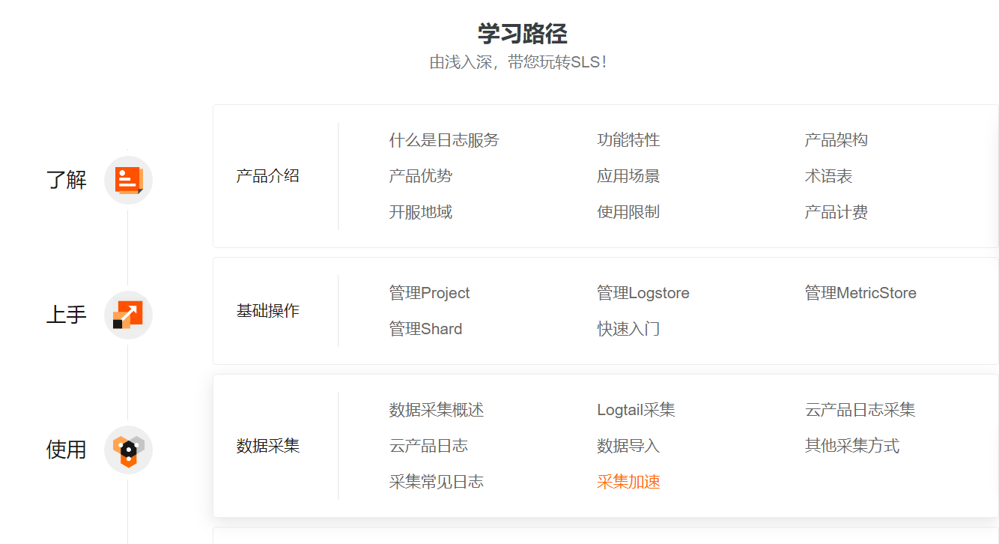

# 1、云原生观测与分析平台-阿里（日志服务）

​		日志服务SLS是云原生观测与分析平台，为Log、Metric、Trace等数据提供大规模、低成本、实时的平台化服务。日志服务一站式提供数据采集、加工、查询与分析、可视化、告警、消费与投递等功能，全面提升您在研发、运维、运营、安全等场景的数字化能力。



## 功能特性

### 数据采集

日志服务提供50多种数据接入方案。具体说明如下：

- 支持采集服务器与应用相关的日志、时序数据和链路数据。
- 支持采集物联网设备日志。
- 支持采集阿里云产品日志。
- 支持采集移动端数据。
- 支持采集Logstash、Flume、Beats、FluentD、Telegraph等开源软件中的数据。
- 支持通过HTTP、HTTPS、Syslog、Kafka、Prometheus等标准协议接入数据。


更多信息，请参见[数据采集概述](https://help.aliyun.com/document_detail/28981.htm#concept-ikm-ql5-vdb)。

### 查询与分析

日志服务支持实时查询与分析数据。具体说明如下：

- 支持精确查询、模糊查询、全文查询、字段查询。
- 支持上下文查询、日志聚类、LiveTail、重建索引等功能。
- 支持标准的SQL 92语法。
- 提供SQL独享实例。


更多信息，请参见[查询概述](https://help.aliyun.com/document_detail/43772.htm#concept-wjl-x3q-zdb)和[分析概述](https://help.aliyun.com/document_detail/53608.htm#concept-nyf-cjq-zdb)。

### 数据加工

日志服务提供数据加工功能，用于数据的规整、富化、流转、脱敏和过滤。具体说明如下：

- 数据规整：针对混乱格式的日志进行字段提取、格式转换，获取结构化数据以支持后续的流处理、数据仓库计算。
- 数据富化：对日志（例如订单日志）和维表（例如用户信息表）进行字段连接（JOIN），为日志添加更多维度的信息，用于数据分析。
- 数据流转：通过全球加速功能将海外地域的日志传输到中心地域，实现全球日志集中化管理。
- 数据脱敏：对数据中包含的密码、手机号、地址等敏感信息进行脱敏。
- 数据过滤：过滤出关键服务的日志，用于重点分析。


更多信息，请参见[数据加工概述](https://help.aliyun.com/document_detail/125384.htm#concept-1130481)。

### 消费与投递

日志服务提供消费与投递功能，支持通过SDK、API实时消费数据；支持通过

控制台

将数据实时投递至OSS、MaxCompute等阿里云产品中。具体说明如下：

- 支持通过Splunk、QRadar、Logstash、Flume等第三方软件消费数据。
- 支持通过Java、Python、GO等语言消费数据。
- 支持通过函数计算、实时计算、云监控等阿里云产品消费数据。
- 支持通过Flink、Spark、Storm等流式计算平台消费数据。
- 支持将数据投递到OSS、MaxCompute、AnalyticDB、TSDB、TableStore等阿里云产品。


更多信息，请参见[实时消费概述](https://help.aliyun.com/document_detail/28997.htm#concept-c34-tnq-zdb)和[数据投递概述](https://help.aliyun.com/document_detail/43724.htm#concept-q2h-g4q-zdb)。

### 可视化

日志服务支持可视化展示查询和分析结果。具体说明如下：

- 仪表盘内置图表：日志服务为您提供表格、线图、柱状图等多种统计图表，您可以根据分析需求选用合适的图表类型展示查询和分析结果，并将结果保存到仪表盘中。
- 第三方可视化工具：日志服务支持直接对接Grafana、DataV等第三方图表。


更多信息，请参见[可视化概述](https://help.aliyun.com/document_detail/102530.htm#concept-tnt-lgj-kgb)。

### 告警

日志服务提供一站式的告警监控、降噪、事务管理、通知分派的智能运维平台。具体说明如下：

- 告警监控：支持通过告警监控规则定期检查评估查询和分析结果，触发告警或恢复通知，发送给告警管理系统。
- 告警管理：支持通过告警策略对所接收到的告警进行**路由分派、抑制、去重、静默、合并**等操作，然后发送给通知（行动）管理系统。
  - **！！！告警合并：按资源分类维度合并成1条，再推送；**
  - **推送列表开发**
- 通知（行动）管理：支持通过行动策略将告警动态分派给特定的通知渠道，再通知给目标用户、用户组或值班组。
- 开放告警：支持通过Webhook方式接收外部监控系统中的告警消息（例如Grafana告警、Prometheus告警），并完成告警管理、告警通知等操作。


更多信息，请参见[告警概述](https://help.aliyun.com/document_detail/209951.htm#concept-2061512)。

### 日志审计

日志审计服务在继承现有日志服务所有功能基础上还支持自动化采集、对接其他生态产品等功能。具体说明如下：

- 支持实时自动化、中心化采集多账号下的云产品日志并进行审计。
- 覆盖基础（ActionTrail、容器服务Kubernetes版）、存储（OSS、NAS）、网络（SLB、API网关）、数据库（关系型数据库RDS、云原生分布式数据库PolarDB-X、PolarDB MySQL云原生数据库）、安全（WAF、DDoS防护、云防火墙、云安全中心）等云产品。
- 支持自由对接其他生态产品或自有SOC中心。
- 内置百种告警规则，支持一键式开启，覆盖账户安全、权限管理、存储、主机、数据库、网络、日志等各个方面的合规监控。


更多信息，请参见[日志审计概述](https://help.aliyun.com/document_detail/164065.htm#concept-2485064)。


# 2、Humio

​		Humio 是 2016 年成立的一家英国公司，2021 年 3 月被 CrowdStrike 收购（$352 million 现金加 $40 million 股票期权）。产品提供日志的搜索、统计、仪表盘、告警服务。

## 数据路径

Humio 用 Kafka 充当数据 buffer，落盘数据到内置存储供查询分析。可以开启投递到 S3。


由于轻索引方案延迟表现不满足告警、仪表盘场景，但大部分时候它们的 query 模式固定，且按时间顺序进行。Humio 的方案是流计算，在数据摄入的 pipeline 中计算告警和图表：

- 只处理实时数据。
- 数据不需要排序。
- 数据都在内存中更新。


## 存储

内置存储主要服务的是日志搜索、分析场景，数据的压缩、索引对于后续的计算性能有决定性影响。

Humio 将数据按照 bucket 排列，在 bucket 上做好一些标签，标签内容包括：

- 数据的时间区间。
- 数据的来源、类型。
- 基于数据 key-value 的 bloom filter（增加 4% 存储以支持随机关键词）。


## 计算

Humio 语法是管道式 SPL：

```text
#host=github #parser=json
| repo.name=docker/*
| groupBy(repo.name, function=count())
| sort()
```

对应的执行计划：读数据、标签过滤、扫描过滤、聚合计算、结果写出。


# 3、ChaosSearch


# 4、Opstrace

​		Opstrace 成立于 2019 年初，2021 年底被 GitLab 收购（是其上市以后的首次收购）。**Opstrace 的关键词是开源（Datadog/Splunk/SignalFx 替代品），一套自动化编排流程帮助用户实现可观测平台。**


# 5、Loki 

作者：阿里云日志服务
链接：https://zhuanlan.zhihu.com/p/538340798
来源：知乎
著作权归作者所有。商业转载请联系作者获得授权，非商业转载请注明出处。


Loki 是 Grafana 公司开源的一款日志分析软件，主要思想是用“Label Index + 暴力搜索”来解决问题。和 Elasticsearch 形成明显的差异：

- 写多读多，强 Schema 日志模型能实现可预期的低计算延时。
- 写多读少，非全文索引模式将成本大幅缩减并后置到查询时产生。

Loki 的文档和代码资料都很多，这里只作简单介绍。

数据存储：

- Index：Label 索引定义为 meta 字段索引，要求 cardinality 小（否则会索引爆炸，实测出现系统不可写入情况），例如在 K8s 场景 namespace、container、host、filepath 作为 Label 来搜索是非常合适的。
- Chunk：日志正文，行存格式，一组日志排列在一起，每条日志只包括 Timestamp 和 Line 两个字段。
- Index 存储：历史上写过 NoSQL，就目前情况来看未来都会用 S3（用 boltdb 来写索引文件，定时 flush）。
- Chunk 存储：一直建议用 S3 这样的对象存储。

架构上多个角色分工明确，可以独立扩容：

- Distributor：接受数据写入，根据协调服务内容转发数据给 Ingester。

- Ingester：

- - 处理数据写入，负责 Chunk 构建，flush 数据到远端存储。
  - 响应赖在 Querier 的查询请求（内存未 flush 部分）。

- Query Frontend：查询请求处理的第一站，负责简单的 query 改写，大 query 切分与分派，cache 处理。

- Querier：查询请求的 mapper 节点，负责 query 解析、执行，数据拉取，结果合并。

- Ruler：调度器，用于预计算。L	abel 索引方案在做大规模 metric 计算时可能延时较高，部分场景下可救急。