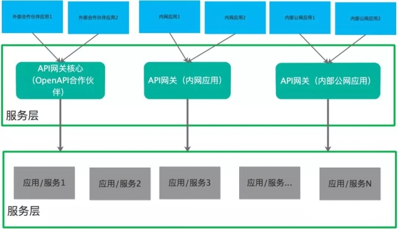
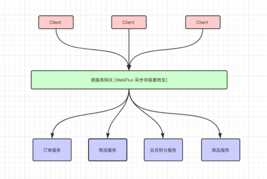
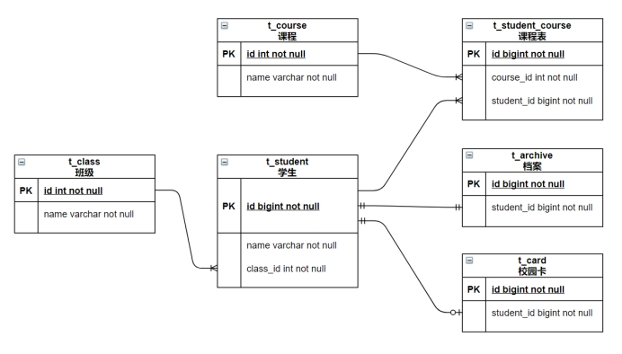
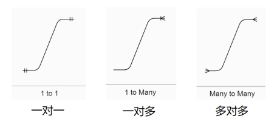
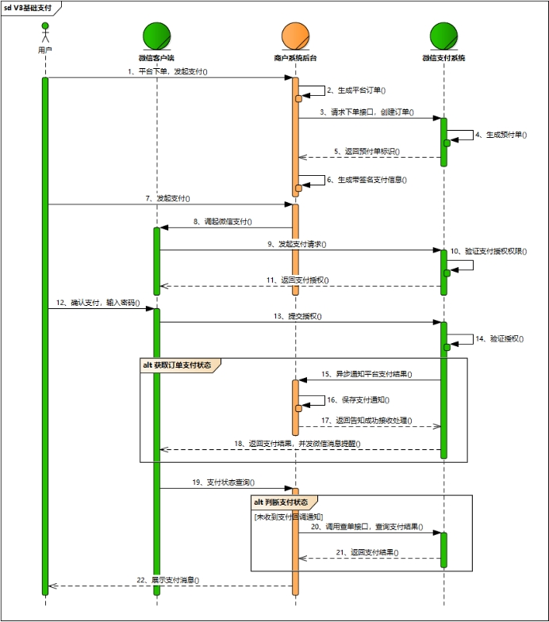
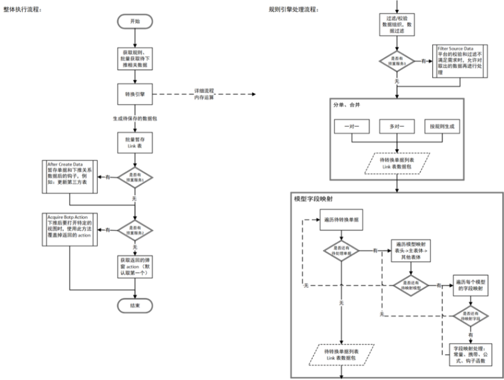
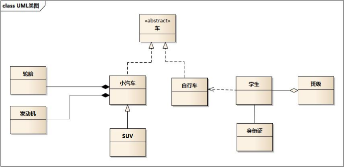

# **XXX设计文档**

| **版本/修订版** | **日期** | **作者** | **修改记录** | **备注** |
| --------------- | -------- | -------- | ------------ | -------- |
|                 |          |          |              |          |
|                 |          |          |              |          |
|                 |          |          |              |          |
|                 |          |          |              |          |
|                 |          |          |              |          |

## 1、概要说明

背景：

​	 随着企业信息系统复杂度的提高，必然出现外部合作伙伴应用、企业自身的公网应用、企业内网应用等，为了对他们的API进行管理，就需要一个统一的出入口API网关，根据不同的场景可以归类为：API网关（OpenAPI合伙伙伴应用）、API网关（内部应用）、API网关（内部公网应用）。同时，微服务网关还能具有负载均衡，缓存，路由，访问控制，服务代理，监控，日志等功能。

 

 

【再写一些对这个需求的思考】，考虑使用 Springboot + WebFlux（Netty）的方案来自研网关管理平台，方便未来扩展接入服务注册与发现、限流熔断、监控、配置中心等 Java 生态设施。

 

需求文档参考：http://XXXX

### 1.1 功能说明

### 1.2 关联指标

## 2、表结构及关系ER 图

### **2.1.** 应用表

| 表名    | rule_app         |              |        |          |
| ------- | ---------------- | ------------ | ------ | -------- |
| 描述    | 应用管理表       |              |        |          |
| 主键    | id               |              |        |          |
| 索引    | app_key          |              |        |          |
| 字段名  | 描述             | 类型         | 默认值 | 是否必录 |
| id      | 内码             | bigint(20)   | 自增长 |          |
| app_key | 应用唯一标识 key | varchar(30)  |        | 是       |
| name    | 应用名称         | varchar(100) |        | 是       |
| ……      |                  |              |        |          |

 

### **2.2.** **应用接口表**

| 表名    | rule_app_api                 |             |        |          |
| ------- | ---------------------------- | ----------- | ------ | -------- |
| 描述    | 每个应用下允许访问的接口列表 |             |        |          |
| 主键    | id                           |             |        |          |
| 索引    | app_key                      |             |        |          |
| 字段名  | 描述                         | 类型        | 默认值 | 是否必录 |
| id      | 反写规则内码                 | bigint(20)  | 自增长 |          |
| app_key | 应用 key                     | varchar(30) |        | 是       |
| api_key | 接口key                      | varchar(30) |        | 是       |
| ……      |                              |             |        |          |

 

### **2.3.** ER

 

 

 

解释一下：

 

一般情况下，我们使用这三种实体关系也够了，“一对多“ 可以反过来表示为 ”多对一“。

举个例子：

1、一个班级只有一个班主任 （班级和班主任的关系一对一）

2、一个班级有很多个学生 （班级和学生的关系是一对多，学生跟班级的关系是多对一）

3、每个学生要学很多课程，每门课程有很多学生要学 （课程和学生的关系多对多）

 

标识关系中，子表中的记录不能脱离父表而独立存在。

非标识关系中，子表中的记录可以独立存在，而不依赖于父表。

### **2.4. 索引设计** （es）-- 只保留该章节

#### 2.4.1 mapping策略、索引分区策略

#### 2.4.2 索引-指标对应关系（用在哪个功能模块，关联章节1）

- 

## 3、**业务流程图**（按照人操作的维度）

 

重点步骤说明：

步骤3 用户下单发起支付，商户可通过统一下单API创建支付订单。

步骤8 商户可通过JSAPI调起支付API调起微信支付，发起支付请求。

步骤15 用户支付成功后，商户可接收到微信支付支付结果通知支付结果通知API。

步骤20 商户在没有接收到微信支付结果通知的情况下需要主动调用查询订单API查询支付结果。

 

这里参考了微信支付业务流程时序图 

https://pay.weixin.qq.com/wiki/doc/apiv3/open/pay/chapter2_3.shtml

 

## 4、**程序流程图（按照代码执行的维度）**

 

 

### 4.1 指标个性化逻辑（**放在程序流图**）

### 4.2 缓存策略（如有--程序流图体现）

## 5、接口设计（对外公开的方法、api 接口等）

### 5.1. **创建应用（demo） -- 转变为使用swagger规范化文档**

| **接口\方法**                                                | /app/create                                     |          |              |
| ------------------------------------------------------------ | ----------------------------------------------- | -------- | ------------ |
| **描述**                                                     | 创建应用                                        |          |              |
| **方式**                                                     | POST                                            |          |              |
| **传参方式**                                                 | application/json （提交上来的是一个 json 对象） |          |              |
| **参数名**                                                   | **描述**                                        | **类型** | **是否**必录 |
| name                                                         | 应用名称                                        | string   | 是           |
| description                                                  | 描述                                            | string   | 否           |
| **输出**                                                     |                                                 |          |              |
| {  "ret": 0,  "data": "返回结果，对象、数组、字符串等",  "msg": "ret 不为 0 时的异常信息",  "time": 1611546530000} |                                                 |          |              |

可能有些需求任务没有接口，可以写一些关键的方法，内容大致一致；

## 6、其他说明（伪代码、类图、思维导图、泳道流程图，对安全、性能、边界情况、性价比的思考）

1、代码类图

 

 

- 车的类图结构为<<abstract>>，表示车是一个抽象类；
- 它有两个继承类：小汽车和自行车；它们之间的关系为实现关系，使用带空心箭头的虚线表示；
- 小汽车为与SUV之间也是继承关系，它们之间的关系为泛化关系，使用带空心箭头的实线表示；
- 小汽车与发动机之间是组合关系，使用带实心箭头的实线表示；
- 学生与班级之间是聚合关系，使用带空心箭头的实线表示；
- 学生与身份证之间为关联关系，使用一根实线表示；
- 学生上学需要用到自行车，与自行车是一种依赖关系，使用带箭头的虚线表示；

**2、非强制，可以是伪代码、类图、思维导图、泳道流程图等**

**3、**对安全、性能、边界情况、性价比的思考

 

 

## 7、附注

 

***附加的解释和说明、引用资料***

 

## 8、评审情况

| **评审时间：** | **评审结论：** |              |            |              |              |
| -------------- | -------------- | ------------ | ---------- | ------------ | ------------ |
| **评审地点：** |                |              |            |              |              |
| **评审人员：** |                |              |            |              |              |
| **序号**       | **评审项**     | **评审角色** | **评审人** | **评审意见** | **评审结论** |
| **1**          | 一、概要说明   | 产品         |            |              |              |
| **2**          | 2.1业务流程图  | 产品         |            |              |              |
| **3**          | 2.2程序流程图  | 产品         |            |              |              |
| **4**          | 三、数据结构   | 产品开发     |            |              |              |
| **5**          | 四、E-R图      | 开发         |            |              |              |
| **6**          | 五、接口方法   | 开发         |            |              |              |
| **7**          | 六、时序图     | 开发         |            |              |              |
| **8**          | 七、类图       | 开发         |            |              |              |

 

***评审标准：***

1、一、概要说明：结合需求文档，描述对这个需求的理解和设计方案。

2、2.1业务流程图：要跟本文档对应的需求文档表述一致，并标示本功能对应的部分。

3、2.2程序流程图：程序处理逻辑要清晰，符合需求文档设计流程。

4、三、数据结构：数据结构完整、清晰，能承载业务所需数据，并充分考虑性能。

5、四、E-R图：应该体现出实体之间的主要关系。

6、五、接口方法：至少包含接口地址、调用方式、入参、结果。 

7、六、时序图：按用户视角，将重要功能的执行顺序。

8、七、类图：关键类的属性以及类与类之间的关系。 

 

 