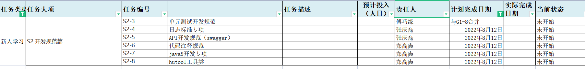

# 2022-08

## 1、第一周（08-01 ~ 08-05）（总人力：4*20 + 2*20）

### **1.1 数瞳核心工作事项（关键字：自研大数据集群适配、澳门演示环境调试）**

- **P6 自研大数据hive集群：适配完成hive集群适配，发布天津完成升级；**
- **P3 澳门三期招标演示**
- **G3+P2  统一告警：输出告警统一接入、查询规范接口文档，完成四川告警接口上线；**
- G8 广东语音需求收尾工作;
- G9 V1.2.2发布：修复gitlab issues相关功能，为发布做准备；

 

### **1.2 Devops核心工作事项（关键字：服务工场流水线开发）**

- **G1 服务工场持续集成流水线开发；**
- **G1 ms开发流程规范梳理；**

### 1.3 新同事学习核心事项

## **2、第二周（08-08 ~ 08-12）**

### **2.1 数瞳核心工作事项（关键字：对账单改版、江苏故障修复）**

- **G2 数据对账单功能优化开发**
- **G5 华为大数据集群es适配**
- **P7 江苏故障修复专项**
- G9 V1.2.2发布：修复gitlab issues相关功能，为发布做准备；（最核心：关闭基础配置所有模块的缓存，仔细测试）
- G4+P2 四川 - 服务网关告警接入

### **2.2 Devops核心工作事项（关键字：流水线优化-编排文件简化）**

- **G1 流水线优化-编排文件简化**

### 2.3 新同事学习核心事项

## **3、第三周（08-15 ~ 08-19）**

### **3.1 数瞳核心工作事项（关键字：版本发布、功能上线）**

- **G7 V1.2.2版本发布，进入提测发布阶段**
- **G7 V1.2.1/ v1.1.0~v1.2.0版本发布：完成发布**
- **G8 上海需求开发及功能上线**

### **3.2 Devops核心工作事项（关键字：单元测试用例开发规范）**

- **G1 单元测试用例开发规范；**
- **G1 自动化测试用例开发工作推进；**

### 3.3 新同事学习核心事项

## **4、第四周（08-22 ~ 08-26）**

### **4.1 核心工作事项：（关键字：数据对账单改版、发布文档）**

- **G2 数据对账单功能优化开发** 
- **G7 V1.2.3版本发布文档编写**
- **G5 适配自研大数据集群es服务**

### **4.2 Devops核心工作事项（关键字：数据工场接入DevOps）**

- **G1 数据工场接入DevOps持续集成流水线；**
- **G1 流水线版优化：代码质量检查规范梳理系列；**

### 4.3 新同事学习核心事项

## **5、第五周（08-29 ~ 09-02）**

第五周做时间冗余，主要预防突发事件导致前序任务受阻

### 5.3 新同事学习核心事项

